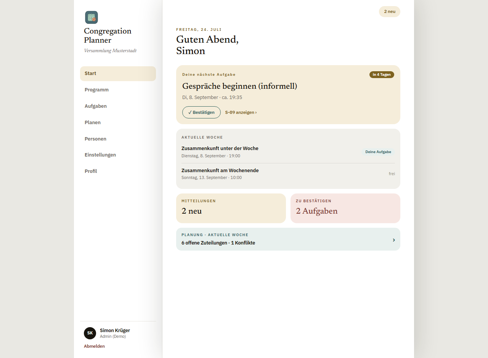
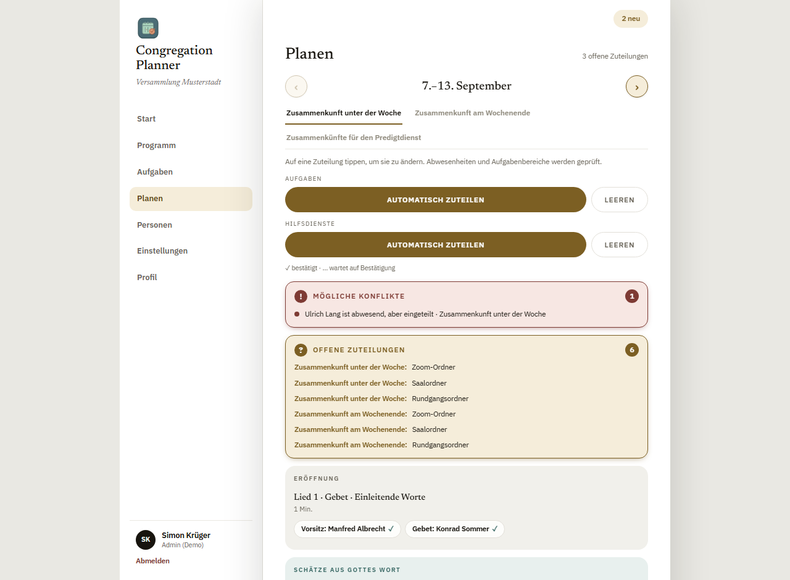
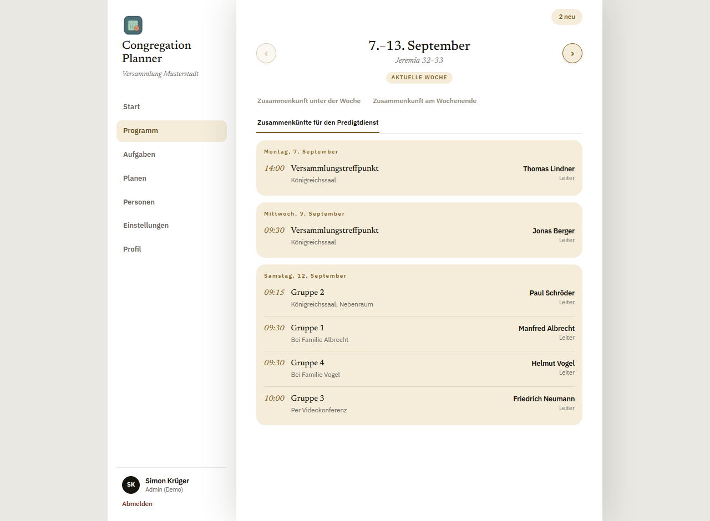
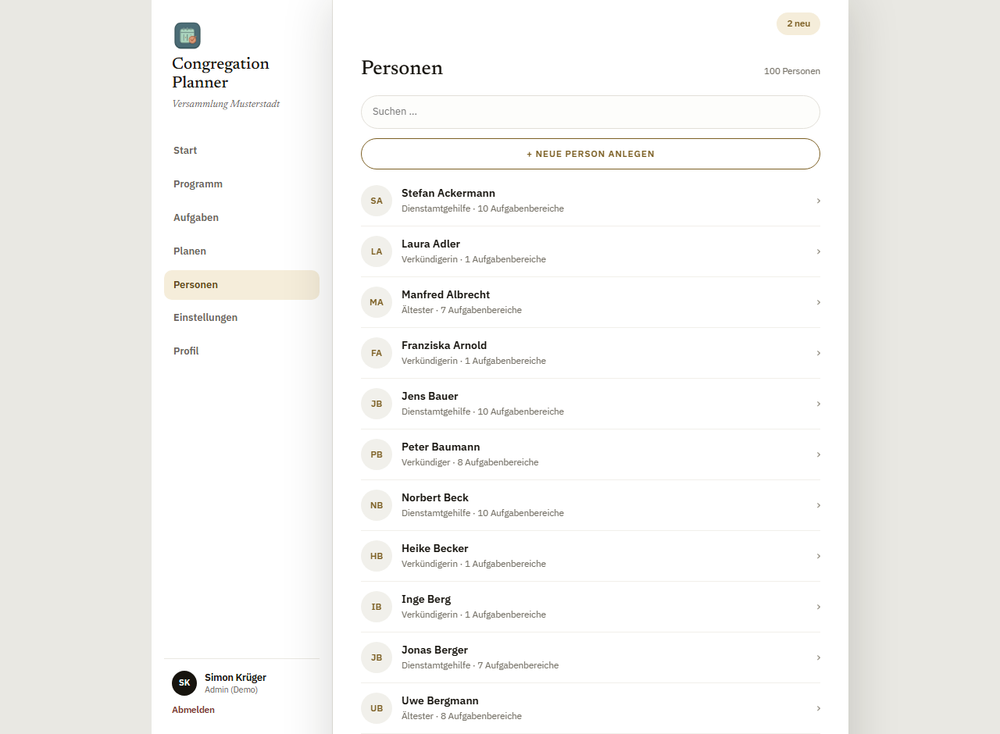
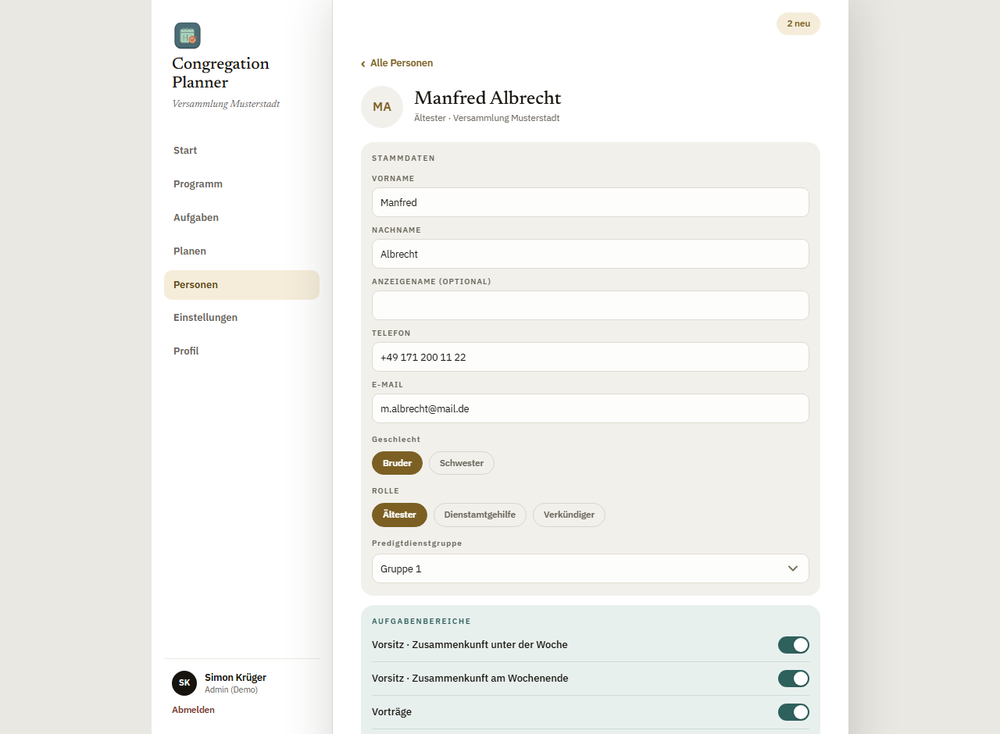
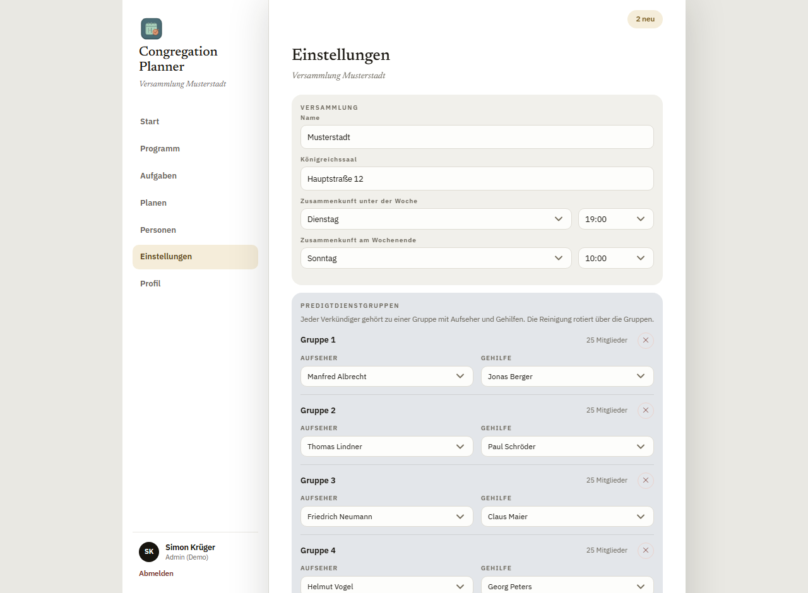

# Benutzerhandbuch für Planer

Dieses Handbuch richtet sich an Koordinatoren und Planer der Versammlung – also an
alle, die Zuteilungen vornehmen, Personen und Gruppen verwalten oder die
Versammlungseinstellungen pflegen.

> Die Grundfunktionen (Anmelden, Programm ansehen, eigene Aufgaben bestätigen,
> Abwesenheiten, Profil) sind im [**Handbuch für Verkündiger**](verkuendiger.md)
> beschrieben und gelten für dich genauso. Dieses Handbuch ergänzt die
> **Planer‑Funktionen**.

---

## Inhalt

1. [Dashboard für Planer](#1-dashboard-für-planer)
2. [Planen: Zuteilungen vornehmen](#2-planen-zuteilungen-vornehmen)
3. [Automatisch zuteilen & leeren](#3-automatisch-zuteilen--leeren)
4. [Konflikte und offene Zuteilungen](#4-konflikte-und-offene-zuteilungen)
5. [Treffpunkte planen](#5-treffpunkte-planen)
6. [Personen verwalten](#6-personen-verwalten)
7. [Einstellungen](#7-einstellungen)
8. [Programm importieren](#8-programm-importieren)
9. [Programm drucken](#9-programm-drucken)

---

## 1. Dashboard für Planer

Als Planer siehst du zusätzlich zur persönlichen Übersicht eine **Planungs‑Karte**
für die aktuelle Woche.

- **Planung · Aktuelle Woche** („6 offene Zuteilungen · 1 Konflikte") führt dich
  mit einem Tippen direkt in die Planung.
- Die Navigation links enthält zusätzlich **Planen**, **Personen** und
  **Einstellungen** – diese Bereiche sehen nur Planer (und Gruppenaufseher einen
  Teil davon).

---

## 2. Planen: Zuteilungen vornehmen

Unter **Planen** teilst du die Aufgaben und Hilfsdienste einer Woche zu. Oben
wechselst du zwischen **Zusammenkunft unter der Woche**, **am Wochenende** und den
**Zusammenkünften für den Predigtdienst**; mit ‹ › wählst du die Woche.

- **Auf eine Zuteilung tippen**, um sie zu ändern. Es öffnet sich eine Liste
  passender Personen. Dabei werden **Abwesenheiten** und **Aufgabenbereiche**
  (Qualifikationen) berücksichtigt, und Doppelbelegungen am selben Tag werden
  angezeigt.
- Programmpunkte (Vorsitz, Gebet, Bibellesung, Schulungsaufgaben …) und
  **Hilfsdienste** (Mikrofone, Ton, Ordner, Reinigung …) werden getrennt geführt.
- Die Legende „✓ bestätigt · … wartet auf Bestätigung" zeigt dir den
  Bestätigungsstatus jeder Person direkt an der Zuteilung.

Das Programm selbst lässt sich hier ebenfalls anpassen: Im Abschnitt **Unser Leben
als Christ** kannst du Punkte hinzufügen, in der Länge (Minuten) anpassen,
verschieben oder entfernen; beim Wochenende trägst du das **Vortragsthema** und
die **Anfangslied‑Nummer** ein.

---

## 3. Automatisch zuteilen & leeren

Oben auf der Planen‑Seite findest du je Bereich zwei Schaltflächen:

| Bereich | Aktion |
| --- | --- |
| **Aufgaben** | **Automatisch zuteilen** besetzt offene Programmpunkte anhand von Qualifikation, Auslastung und Abwesenheiten. **Leeren** entfernt die Zuteilungen des Bereichs. |
| **Hilfsdienste** | Dasselbe für die Hilfsdienste (die Reinigung rotiert dabei über die Predigtdienstgruppen). |

Die Automatik wählt bevorzugt Personen mit der **geringsten Auslastung**, lässt
Abwesende aus und vergibt niemanden doppelt am selben Tag. Externe Redner
(Gastredner, Kreisaufseher) bleiben offen und werden manuell eingetragen. Nach dem
Zuteilen kannst du einzelne Slots wie gewohnt noch von Hand anpassen.

---

## 4. Konflikte und offene Zuteilungen

Die Planen‑Seite weist dich aktiv auf Handlungsbedarf hin:

- **Mögliche Konflikte** – z. B. „Person ist abwesend, aber eingeteilt",
  Doppelbelegungen oder Personen, die drei Wochen in Folge eingeteilt sind.
- **Offene Zuteilungen** – noch unbesetzte Programmpunkte und Hilfsdienste,
  gebündelt aufgelistet.

So siehst du auf einen Blick, was vor der Zusammenkunft noch zu erledigen ist.

---

## 5. Treffpunkte planen

Die **Zusammenkünfte für den Predigtdienst** („Treffpunkte") haben einen eigenen
Reiter unter **Planen**.

Es gibt zwei Arten:

- **Versammlungstreffpunkte** – gelten für die ganze Versammlung.
- **Gruppentreffpunkte** – je Predigtdienstgruppe, mit eigenem Ort und Leiter.

Der regelmäßige Rhythmus kommt aus dem **Grundplan** (siehe
[Einstellungen](#7-einstellungen)); pro Woche kannst du Uhrzeit, Ort und **Leiter**
anpassen oder einen einmaligen Treffpunkt ergänzen. **Gruppenaufseher** können die
Treffpunkte **ihrer** Gruppe selbst planen, ohne vollen Planer‑Zugang.

---

## 6. Personen verwalten

Unter **Personen** pflegst du alle Mitglieder der Versammlung.

- Über **Suchen** findest du schnell eine Person; **+ Neue Person anlegen**
  erstellt einen neuen Eintrag.
- Ein Tippen auf eine Person öffnet ihr Detail:

Im Detail legst du fest:

- **Stammdaten** – Name, Anzeigename, Telefon, E‑Mail, Geschlecht.
- **Rolle** – Ältester, Dienstamtgehilfe oder Verkündiger.
- **Predigtdienstgruppe** – Zuordnung zur Gruppe.
- **Aufgabenbereiche** – welche Aufgaben die Person übernehmen darf (Vorsitz,
  Vorträge, Gebet, Bibellesung, Schulung, Hilfsdienste …). Diese Bereiche steuern,
  wen die Automatik und die Kandidatenlisten vorschlagen.
- **Konto & Einladung** – hier lädst du eine Person zur App‑Nutzung ein (Code bzw.
  Einladungs‑E‑Mail) und vergibst bei Bedarf **Planer‑Rechte**.

Wird eine Person umbenannt, zieht die App den neuen Namen automatisch durch alle
bereits geplanten Wochen.

---

## 7. Einstellungen

Unter **Einstellungen** verwaltest du die versammlungsweiten Grunddaten.

Die Seite enthält mehrere Abschnitte (nach unten scrollen):

- **Versammlung** – Name, Königreichssaal, Wochentage und Uhrzeiten der beiden
  Zusammenkünfte.
- **Predigtdienstgruppen** – Gruppen mit **Aufseher** und **Gehilfe**. Die
  Reinigung rotiert automatisch über die Gruppen.
- **Hilfsdienste** – welche Dienste es gibt und mit wie vielen Plätzen.
- **Erinnerungen** – wie viele Tage vorher und wie oft an offene Aufgaben erinnert
  wird (per Push, nie per E‑Mail).
- **Sprachen** – Versammlungssprache und weitere Programmsprachen. Zusätzliche
  Sprachen werden beim Import als Varianten mitgeholt.
- **Programm‑Import** – neue Wochen von jw.org laden (siehe unten).
- **Treffpunkte‑Grundplan** – die regelmäßigen Versammlungs‑ und
  Gruppentreffpunkte (Wochentag, Uhrzeit, Ort, „N‑ter im Monat").

---

## 8. Programm importieren

Über den **Import** in den Einstellungen holt die App das Arbeitsheft‑Programm der
kommenden Woche direkt von jw.org – inklusive Liedern, Bibelbuch,
Schulungspunkten und der Struktur der Zusammenkünfte. Sind weitere Programmsprachen
konfiguriert, werden deren Varianten gleich mitgeladen. Zuteilungen bleiben dabei
leer und werden anschließend unter **Planen** vergeben.

---

## 9. Programm drucken

Auf der **Programm**‑Seite gibt es eine **Drucken**‑Funktion. Sie druckt die
aktuell gewählte Woche und Zusammenkunft sauber auf eine Seite – **ohne die
Hilfsdienste** und ohne die Bedienelemente der App. Der Ausdruck füllt die Seite
in der Breite und passt sich dem im Druckdialog eingestellten Papierformat an
(z. B. A4).

---

*Dieses Handbuch beschreibt die aktuelle Funktionsvielfalt. Bei neuen oder
geänderten Funktionen wird es zusammen mit den Screenshots aktualisiert
(siehe [README](README.md)).*
