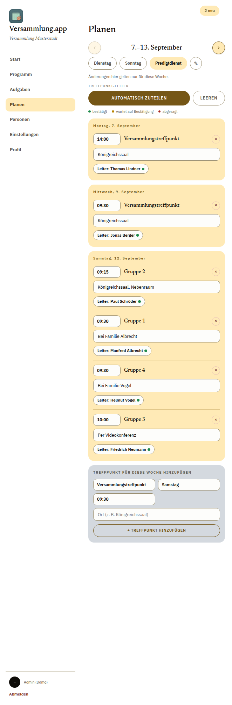

# Benutzerhandbuch für Planer

Dieses Handbuch richtet sich an Koordinatoren und Planer der Versammlung – also an
alle, die Zuteilungen vornehmen, Personen und Gruppen verwalten oder die
Versammlungseinstellungen pflegen.

> Die Grundfunktionen (Anmelden, Programm ansehen, eigene Aufgaben bestätigen,
> Abwesenheiten, Profil) sind im [**Handbuch für Verkündiger**](verkuendiger.md)
> beschrieben und gelten für dich genauso. Dieses Handbuch ergänzt die
> **Planer‑Funktionen**.

---

## Inhalt

1. [Dashboard für Planer](#1-dashboard-für-planer)
2. [Planen: Zuteilungen vornehmen](#2-planen-zuteilungen-vornehmen)
3. [Automatisch zuteilen & leeren](#3-automatisch-zuteilen--leeren)
4. [Konflikte und offene Zuteilungen](#4-konflikte-und-offene-zuteilungen)
5. [Treffpunkte planen](#5-treffpunkte-planen)
6. [Personen verwalten](#6-personen-verwalten)
7. [Einstellungen](#7-einstellungen)
   – [Zusätzliche Klasse](#7a-zusätzliche-klasse)
8. [Programm importieren](#8-programm-importieren)
9. [Pläne drucken](#9-pläne-drucken)
10. [Ohne Internet (offline)](#10-ohne-internet-offline)

---

## 1. Dashboard für Planer

Als Planer steht für dich ganz oben, direkt unter dem Gruß, die
**Planungs‑Karte**: was in den kommenden Wochen noch zu tun ist. Darunter folgt
deine persönliche Übersicht wie bei jedem Verkündiger – deine unbestätigten
Aufgaben legt dir die App ohnehin beim Öffnen vor.

- **Eine Zeile je Woche, in der etwas zu tun ist** – ab der laufenden Woche,
  höchstens vier Wochen voraus. Fertig geplante und gesendete Wochen erscheinen
  nicht. Auch eine Kongresswoche erscheint, wenn dort ein Treffpunkt noch einen
  Leiter braucht.
- Die Zeile nennt, was ansteht, mit denselben Begriffen und Farben wie die
  Hinweise in **Planen** (Abschnitt 4):
  - **Mögliche Konflikte** – z. B. jemand ist eingeteilt, aber abwesend,
  - **Nicht besetzbar** – an dem Tag sind für einen Bereich zu wenige Leute da,
  - **Offene Zuteilungen** – noch unbesetzte Plätze, auch Treffpunkte ohne Leiter,
  - **Plan senden** – Zuteilungen, von denen die Eingeteilten noch nichts wissen.

  Die Zahlen gelten für die **ganze Woche**; in Planen verteilen sie sich auf die
  Reiter. Ein Tipp auf die Zeile öffnet **Planen** genau auf dieser Woche – und
  auf dem Reiter, in dem etwas zu tun ist (ist nur noch ein Treffpunkt-Leiter
  zu benachrichtigen, bei den Treffpunkten).
- **Was vorbei ist, zählt nicht mehr.** Am Donnerstag nennt die Karte nur noch,
  was am Wochenende offen ist; den Dienstag kann niemand mehr besetzen. Die
  Karte merkt den Tageswechsel auch, wenn die App über Nacht offen war.
- Reichen die geladenen Programme **weniger als drei Wochen** voraus, steht in
  der Karte **„Geladen bis …"** mit dem Knopf **Nächste Woche importieren** –
  derselbe wie in den Einstellungen (Abschnitt 8). Der Hinweis verschwindet,
  sobald der Vorrat wieder reicht.
- Ist nichts zu tun, schrumpft die Karte auf eine Zeile **„Alles zugeteilt"** –
  darunter der Zeitraum, für den das gilt. Wochen dahinter hat sie nicht
  angesehen.
- Die Navigation links enthält zusätzlich **Planen**, **Personen** und
  **Einstellungen** – diese Bereiche sehen nur Planer (und Gruppenaufseher einen
  Teil davon). Gruppenaufseher sehen die Startseite wie Verkündiger, ohne
  Planungs‑Karte.

---

## 2. Planen: Zuteilungen vornehmen

Unter **Planen** teilst du die Aufgaben und Hilfsdienste einer Woche zu. Oben
wechselst du zwischen **Zusammenkunft unter der Woche**, **am Wochenende** und den
**Zusammenkünften für den Predigtdienst**; mit ‹ › wählst du die Woche – auf
Handy und Tablet geht auch seitwärts wischen.

Beim Öffnen stehen Planen und Programm auf der **nächsten** Zusammenkunft: am
Samstag also auf dem Wochenende, am Sonntagabend schon auf der Wochenmitte der
kommenden Woche. Entfällt eine (Kongress, Gedächtnismahl), wird sie
übersprungen. Sobald du selbst eine Woche oder einen Reiter wählst, bleibt es
dabei – du wirst beim Hin- und Herwechseln nicht wieder umgesetzt.

Unter den Zuteilungs‑Knöpfen steht **S‑89 DRUCKEN**: ein Tipp auf **Drucken**
legt alle Schülerzettel der offenen Woche als DIN‑A4‑Bogen an, **sechs je
Blatt**. Der Schalter **Gesprächspartner/in** bestimmt, ob der Zettel eines
Gesprächs **zweimal** kommt – einer für den Schüler, einer für die Partnerin
oder den Partner. Beide tragen dieselben Angaben, so wie das Formular es
vorsieht. Die Zettel der Zusätzlichen Klasse sind dabei und tragen ihren Raum.

- **Auf eine Zuteilung tippen**, um sie zu ändern. Es öffnet sich eine Liste
  passender Personen. Dabei werden **Abwesenheiten** und **Aufgabenbereiche**
  (Qualifikationen) berücksichtigt, und Doppelbelegungen am selben Tag werden
  angezeigt.
- Die Abwesenheiten kommen aus den Einträgen, die die Verkündiger selbst in
  ihrem persönlichen Bereich erfassen (**Von–Bis** als Datum). Geprüft wird der
  **Tag der jeweiligen Zusammenkunft**, nicht die Woche: wer nur übers Wochenende
  weg ist, steht unter der Woche weiterhin zur Verfügung. Bei den Treffpunkten
  zählt der Wochentag des jeweiligen Treffpunkts.
- Programmpunkte (Vorsitz, Gebet, Bibellesung, Schulungsaufgaben …) und
  **Hilfsdienste** (Mikrofone, Ton, Ordner, Reinigung …) werden getrennt geführt.
- **Der farbige Punkt hinter jedem Namen** zeigt, ob die Person diese Zuteilung
  zugesagt hat. Die Legende über dem Plan nennt die drei Stufen:
  - **grün** – bestätigt
  - **gelb** – wartet auf Bestätigung
  - **rot** – abgesagt; hier musst du handeln (siehe „Wenn jemand absagt")

  Der Punkt gilt dem **einzelnen Platz**, nicht der Person: Hat jemand den
  Vorsitz bestätigt, das Gebet aber noch nicht, steht Grün neben Gelb. Teilst du
  einen Platz um, steht er wieder auf Gelb – die Zusage gehört dem, der sie
  gegeben hat. Wo niemand bestätigen kann (offener Platz, Gastredner,
  Kreisaufseher, Reinigungsgruppe, Treffpunkt-Leiter von außerhalb, eine
  ausgefallene Zusammenkunft), steht kein Punkt. Die Farben passen zu jedem Farbschema; die drei Stufen unterscheiden
  sich zusätzlich in der Helligkeit, damit sie auch bei Rot-Grün-Schwäche
  auseinanderzuhalten sind.

**Schülerteile im Abschnitt „Uns im Dienst verbessern"** brauchen je nach Art
ein oder zwei Personen. Gesprächsteile (Gespräche beginnen, Interesse fördern,
Menschen zu Jüngern machen) haben einen **Hauptteilnehmer** und einen
**Gesprächspartner** – beide werden getrennt zugeteilt. Vorträge/Ansprachen
haben nur einen (männlichen) Teilnehmer. Die App legt die passende Zahl beim
Import automatisch an; mit **„+ / – Gesprächspartner"** unter dem Teil kannst du
den Partner bei Bedarf hinzufügen oder entfernen. Für den Gesprächspartner
werden nur Personen mit demselben Geschlecht vorgeschlagen – **oder
Familienangehörige** (siehe „Familie" im Personen‑Detail), die auch
geschlechtsübergreifend zusammen eingeteilt werden dürfen. Wer nur als Partner
(nicht als Gesprächsführer) eingeteilt werden soll, bekommt in den Personendaten
den Bereich **„Schulungsaufgaben Partner"**. Die automatische Zuteilung setzt
Gesprächsteile bevorzugt mit Verkündigern und Schwestern (nicht mit Ältesten/
Dienstamtgehilfen) und achtet auf gleiches Geschlecht der beiden Partner.

Das Programm selbst lässt sich hier ebenfalls anpassen: Im Abschnitt **Unser Leben
als Christ** kannst du Punkte hinzufügen, in der Länge (Minuten) anpassen,
verschieben oder entfernen; beim Wochenende trägst du das **Vortragsthema** und
die **Anfangslied‑Nummer** ein.

**Die Dauer tippst du direkt ein.** Neben jedem Punkt steht ein Feld mit der
Minutenzahl — hineinklicken, Zahl eintragen, fertig. Übernommen wird sie, sobald
du das Feld verlässt (oder Enter drückst); **Esc** verwirft die Eingabe, und ein
leer gelassenes Feld ändert nichts. Erlaubt sind **5 bis 45 Minuten**; wer mehr
einträgt, bekommt 45. Die **Endzeit der Zusammenkunft** unten wandert
automatisch mit.

---

## 3. Automatisch zuteilen & leeren

Oben auf der Planen‑Seite findest du je Bereich zwei Schaltflächen:

| Bereich | Aktion |
| --- | --- |
| **Aufgaben** | **Automatisch zuteilen** besetzt offene Programmpunkte anhand von Qualifikation, Auslastung und Abwesenheiten. **Leeren** entfernt die Zuteilungen des Bereichs. |
| **Hilfsdienste** | Dasselbe für die Hilfsdienste (die Reinigung rotiert dabei über die Predigtdienstgruppen). |

Die Automatik wählt bevorzugt Personen mit der **geringsten Auslastung**, lässt
Abwesende aus und vergibt niemanden doppelt am selben Tag. Externe Redner
(Gastredner, Kreisaufseher) bleiben offen und werden manuell eingetragen. Nach dem
Zuteilen kannst du einzelne Slots wie gewohnt noch von Hand anpassen.

### Sonderwoche: verlegen oder absagen

Manchmal weicht eine Woche ab — mehrere Versammlungen teilen sich einen Saal,
eine hat Dienstwoche, und ihr müsst euren Tag verschieben. Oder es ist
Kongress und die Zusammenkunft entfällt ganz.

Dafür gibt es im **Planen**-Tab einen eigenen Reiter neben „Dienstag",
„Sonntag" und „Predigtdienst": den **Stift** (✎). Er gehört der ganzen Woche,
nicht einer einzelnen Zusammenkunft — deshalb stellst du dort **beide**
Zusammenkünfte ein, ohne den Reiter zu wechseln. Je Zusammenkunft steht ein
Feld:

| Bedienelement | Wirkung |
| --- | --- |
| **Schalter** neben dem Namen der Zusammenkunft | Aus = sie findet in dieser Woche **nicht** statt |
| **Wochentag** | Verlegt sie auf einen anderen Tag |
| **Uhrzeit** | Verlegt den Anfang |
| **Grund** | Freitext, erscheint im Hinweis — z. B. „Kongress in Nürnberg" |

Wählst du wieder den regulären Tag bzw. die reguläre Uhrzeit, ist die Verlegung
damit aufgehoben; das Feld verliert seine Hervorhebung.

**Was daran hängt.** Eine Verlegung zieht alles mit: den Termin in „Meine
Aufgaben", das S-89-Formular, die Erinnerungen und die Beschriftung der Reiter.
Fällt eine Zusammenkunft aus, hat sie keine offenen Plätze mehr, taucht in
keiner Konfliktprüfung auf, wird nicht automatisch zugeteilt, verschickt keine
Erinnerungen und zählt bei niemandem auf die Auslastung.

**Die Zuteilungen bleiben trotzdem stehen.** Nimmst du den Ausfall zurück, ist
deine Planung wieder da — es geht nichts verloren.

> Die Gedächtnismahl-Woche ist **kein** Ausfall: dort wird der reguläre Ablauf
> ersetzt, das Mahl hat eigene Zuteilungen. Dafür gibt es weiterhin den eigenen
> Hinweis.

### Weitere Termine der Woche

Zu einer Woche gehört manchmal mehr als die beiden Zusammenkünfte und die
Treffpunkte — eine **Pionierbesprechung**, eine **Besprechung mit
Dienstamtgehilfen und Ältesten**, was sonst ansteht.

Im **Stift**-Reiter (✎) legst du mit **+ HINZUFÜGEN** so viele Termine an, wie
du brauchst. Jeder hat vier Felder, alle bis auf den Namen freiwillig:

| Feld | Wofür |
| --- | --- |
| **Name** | Wie der Termin heißen soll — deine Worte, z. B. „Pionierbesprechung" |
| **Wochentag** | Lass ihn auf „—", solange der Tag noch nicht feststeht |
| **Uhrzeit** | |
| **Ort** | Freitext, z. B. „Königreichssaal" |

Die Termine erscheinen im **Programm** über den Reitern — also auf jedem
Reiter, denn sie gehören zu keiner einzelnen Zusammenkunft. **Alle sehen sie**,
und zwar nach Wochentag und Uhrzeit geordnet; Termine ohne Tag stehen hinten.

> **Ein Termin ist eine Ankündigung, keine Zuteilung.** Es gibt dazu keinen
> Bearbeiter, keine Bestätigung und keine Erinnerung — er steht einfach da.
> Wer etwas leiten soll, bekommt es als Programmpunkt oder Treffpunkt.

Name und Ort bleiben so stehen, wie du sie schreibst; sie werden **nicht**
übersetzt — es sind deine Worte, wie der Grund einer Verlegung. Nur der
Wochentag erscheint bei jedem in seiner eigenen Sprache.

### Besuch des Kreisaufsehers

Im selben Feld sitzt der Schalter **Besuch des Kreisaufsehers**. Er betrifft
beide Zusammenkünfte auf einmal:

| | Was passiert |
| --- | --- |
| **Unter der Woche** | Aus dem Versammlungsbibelstudium wird der **Dienstvortrag** — 30 Minuten, ein Platz, kein Leser |
| **Wochenende** | Das Wachtturm-Studium wird auf **30 Minuten** verkürzt und braucht **keinen Leser** mehr; dahinter kommt ein **Vortrag** von 30 Minuten |

Die Endzeiten ändern sich dabei nicht.

**Das Thema** trägst du direkt am Punkt ein, hinter der Bezeichnung — wie beim
öffentlichen Vortrag.

**Die Namen trägst du selbst ein**, an jedem der drei Plätze einzeln
(Dienstvortrag, öffentlicher Vortrag, Vortrag am Wochenende). Das ist Absicht:
der Kreisaufseher bringt manchmal jemanden mit, den er schult, und die
Begleitung kann eine dieser Aufgaben übernehmen — welche, steht vorher nicht
fest. Alle drei nehmen deshalb Freitext.

Wer dort steht, bekommt **keine Erinnerung, keine Bestätigungsanfrage und keine
Anrechnung auf die Auslastung** — er gehört ja nicht zur Versammlung.

**Schaltest du wieder aus**, ist alles zurück: das Bibelstudium samt seiner
Zuteilungen, das volle Wachtturm-Studium mit Leser. Es geht nichts verloren,
falls der Besuch verschoben wird.

### Öffentlicher Vortrag: Gastredner oder eigener Redner

Der Rednerplatz am Wochenende kann beides sein, und du entscheidest es Woche für
Woche — im Zuteilungs-Fenster, ohne einen zusätzlichen Schalter:

| Was du tust | Was daraus wird |
| --- | --- |
| Name und Versammlung in die **Freitext-Felder** eintragen | Gastredner. Er bekommt keine Aufgabe, keine Erinnerung, keine Bestätigung und zählt nicht auf die Auslastung — er gehört ja nicht zu euch. |
| Eine **Person aus der Liste** antippen | Ein Bruder eurer Versammlung. Er bekommt die Aufgabe wie jede andere: Bestätigung, Erinnerung, Anrechnung auf die Auslastung. |

Beides steht im selben Fenster untereinander, jeder Weg führt also auch wieder
zurück. **Entfernen** und **Leeren** setzen den Platz auf „Gastredner" zurück —
den Redner des öffentlichen Vortrags vereinbart man, deshalb besetzt die
Automatik ihn nie von sich aus.

Ein auswärtiger Redner muss dafür **nicht** als Person angelegt werden.

Die Auslastung zählt dieselben **fünf Wochen**, die du im Zuteilungs-Fenster
unter jedem Namen siehst („2 Aufgaben in 5 Wochen") und die die fünf kleinen
Quadrate daneben zeigen – die Zahl erklärt also genau die Reihenfolge, in der die
Personen dort stehen. Sind mehrere gleichauf — bei den Schulungsaufgaben der
Normalfall, weil es mehr Schwestern als Plätze gibt —, kommt zuerst, **wer am
längsten nicht dran war**; dafür schaut die Automatik über alle geladenen Wochen,
nicht nur über das Fenster. Aufgaben in der
Zusätzlichen Klasse zählen dabei genau wie die im Hauptsaal, der Ratgeber
ebenfalls. So kommt über die Monate jeder ähnlich oft an die Reihe, statt dass
einzelne Namen dauerhaft vorn oder hinten stehen.

Zuletzt wird noch **der Aufgabenbereich selbst** ausgeglichen: wer zuletzt das
Gespräch geführt hat, tritt beim nächsten Gesprächsteil hinter jemanden zurück,
der zuletzt Gesprächspartner war. Sonst kann es passieren, dass eine Schwester
zwar gleich viele Aufgaben hat wie alle anderen, davon aber fast immer die
Partnerrolle. Dasselbe gilt für Brüder, die sowohl die Bibellesung als auch den
Leser übernehmen können.

---

## 4. Konflikte und offene Zuteilungen

Die Planen‑Seite weist dich aktiv auf Handlungsbedarf hin:

- **Mögliche Konflikte** – „Person ist abwesend, aber eingeteilt",
  Doppelbelegungen und „Hilfsdienst und Aufgabe am selben Tag". Es steht nur
  da, was so nicht bleiben kann; dass jemand mehrere Wochen hintereinander
  drankommt, meldet die App nicht mehr – in einer kleinen Versammlung ist das
  der Normalfall, und die Meldung verdeckte die wichtigen daneben.
- **Nicht besetzbar** – Bereiche, in denen an diesem Tag **weniger Leute
  verfügbar sind als Plätze zu besetzen**: „Mikrofone · nötig 3 · verfügbar 2 ·
  abwesend 8 von 10". Die Zahl oben rechts sagt, wie viele Plätze deshalb offen
  bleiben *müssen*. Das ist kein Rückstand, sondern eine Grenze — die
  automatische Zuteilung lässt diese Plätze kommentarlos leer, und ohne den
  Hinweis suchst du den Fehler bei dir.
- **Offene Zuteilungen** – noch unbesetzte Programmpunkte und Hilfsdienste,
  gebündelt aufgelistet.

So siehst du auf einen Blick, was vor der Zusammenkunft noch zu erledigen ist.

> Die Rechnung ist **vorsichtig**: Gezählt wird je Bereich einzeln, und wer für
> zwei Bereiche taugt, zählt in beiden mit — obwohl er an dem Tag nur eine
> Aufgabe übernimmt. Der Engpass kann also größer ausfallen als gemeldet, nie
> kleiner. Lieber eine Warnung zu wenig als eine grundlose: Eine, die auch nur
> manchmal ohne Anlass erscheint, klickt man weg — und übersieht sie dann auch,
> wenn sie stimmt.

Die genannten Zuteilungen **heben sich im Programm darunter ab** – kräftiger
Rand und ein Punkt davor, wie ihn auch jede Zeile im Banner trägt; in beiden
Zusammenkünften, in der Zusätzlichen Klasse, bei den Hilfsdiensten und bei den
Treffpunkten. Du musst den Namen aus dem Banner also nicht suchen: Beim
Durchgehen der Zusammenkunft fällt er von selbst auf.

### Wenn jemand absagt

Verkündiger können eine Zuteilung in ihren Aufgaben absagen. Du bekommst dann
eine Mitteilung („Verhinderung gemeldet"), und der Punkt an der Zuteilung wird
**rot**.

Bei **Hilfsdiensten** übernimmt die App den ersten Schritt selbst: Sie
benachrichtigt alle, die für diesen Dienst eingetragen und an dem Tag nicht
abwesend sind, dass ein Ersatz gesucht wird. Springt jemand ein, trägt sich die
Person selbst ein, die Bestätigung ist gleich gesetzt (der Punkt wird grün), und
du bekommst die Mitteilung „Ersatz gefunden". Du musst dich nur kümmern, wenn
sich niemand meldet.

Bei **Programmpunkten** gibt es keine automatische Suche — dort teilst du neu
zu. Der Name des Absagenden bleibt mit rotem Punkt im Slot stehen, damit du
siehst, worum es geht.

### Den Plan senden

**Solange du planst, erfährt niemand etwas.** Das ist Absicht: Beim Planen wird
umsortiert, und für jeden Zwischenstand eine Nachricht zu verschicken wäre eine
Zumutung. Wann die Woche steht, entscheidest du.

Ganz unten im Planen-Screen steht dafür **PLAN SENDEN**. Die Karte sagt dir,
wie viele Zuteilungen dieser Woche noch niemandem mitgeteilt sind; sind es nur
noch wenige, nennt sie auch die Namen. Ein Tipp auf **Plan senden**, und jede
eingeteilte Person bekommt **eine** Nachricht mit allen ihren Aufgaben dieser
Woche — in der App und, wo aktiviert, als Push.

Drei Dinge, auf die du dich verlassen kannst:

- **Es geht nichts doppelt hinaus.** Die App merkt sich, welcher Platz mit
  welchem Namen schon gemeldet wurde. Besserst du danach einen Platz nach und
  drückst noch einmal, bekommt nur die neue Person eine Nachricht.
- **Wer kein App-Konto hat, bleibt danach sichtbar stehen.** Diese Namen musst
  du persönlich ansprechen — die Karte nennt sie dir, bis du die Woche
  wechselst.
- **Der Knopf gilt für die ganze Woche**, beide Zusammenkünfte und die
  Treffpunkte. Du musst ihn nicht in jedem Reiter drücken.
- **Was vorbei ist, geht nicht mehr hinaus.** Am Donnerstag zählt der Knopf die
  Plätze vom Dienstag nicht mehr mit, und niemand bekommt eine Nachricht über
  eine Zusammenkunft, die gewesen ist. Am Tag der Zusammenkunft selbst zählt
  sie noch.

Darunter steht, wann für diese Woche zuletzt etwas hinausging.

> **Eine Ausnahme wartet nicht auf den Knopf.** Nimmst du jemandem eine Aufgabe
> weg, die er **schon bestätigt** hatte, erfährt er das sofort („Zuteilung
> zurückgezogen"). Wer zugesagt hat, bereitet vor — er soll nicht weiter für
> etwas üben, das ihm nicht mehr gehört. Unbestätigte Zuteilungen darfst du
> umsortieren, ohne dass jemand etwas merkt.
>
> **Was dabei nicht als „weggenommen" gilt:** eine Zusammenkunft, die du
> ausfallen lässt (in einer Kongress-Woche fallen alle aus) — die Zuteilungen
> ruhen dann nur. Ebenso das Abschalten der Zusätzlichen Klasse: Ihre Namen
> bleiben stehen und kommen beim Einschalten wieder. Und eine berichtigte
> Schreibweise eines Namens ist ohnehin keine Änderung an der Zuteilung. Und ein
> Platz, dessen Termin schon **vorbei** ist: Trägst du am Donnerstag nach, wer
> am Dienstag wirklich gelesen hat, nimmst du niemandem etwas, das er noch
> vorbereiten müsste. In all diesen Fällen geht keine Nachricht hinaus.

---

## 5. Treffpunkte planen

Die **Zusammenkünfte für den Predigtdienst** („Treffpunkte") haben einen eigenen
Reiter unter **Planen**.

Es gibt zwei Arten:

- **Versammlungstreffpunkte** – gelten für die ganze Versammlung.
- **Gruppentreffpunkte** – je Predigtdienstgruppe, mit eigenem Ort und Leiter.

Der regelmäßige Rhythmus kommt aus dem **Grundplan** (siehe
[Einstellungen](#7-einstellungen)); pro Woche kannst du Uhrzeit, Ort und **Leiter**
anpassen oder einen einmaligen Treffpunkt ergänzen. **Gruppenaufseher** können die
Treffpunkte **ihrer** Gruppe selbst planen, ohne vollen Planer‑Zugang.

> **Wer sieht was.** Einen Gruppentreffpunkt zeigt das Programm nur den
> Verkündigern **dieser** Gruppe (und ihrem Aufseher). Versammlungstreffpunkte
> sehen alle. Du als Planer siehst weiterhin alles — du planst ja für jede
> Gruppe.

**Der Leiter kann auch jemand von außerhalb sein.** In der Dienstwoche leitet
in der Regel der **Kreisaufseher** den Treffpunkt, und der steht in keiner
Personenliste. Tippe den Treffpunkt-Leiter an: Oben im Blatt gibst du einen
**Namen als Freitext** ein und bestätigst mit **ÜBERNEHMEN** — darunter steht
weiterhin die Liste der eigenen Verkündiger, falls es doch jemand von euch
sein soll. Beide Wege führen zurück, du kannst also jederzeit wechseln.

> Ein Freitext-Leiter hat die App nicht: Er bekommt keine Aufgabe, keine
> Erinnerung und keinen farbigen Punkt, und er zählt bei niemandem auf die
> Auslastung. Auch dann nicht, wenn er zufällig so heißt wie jemand bei euch.

---

## 6. Personen verwalten

Unter **Personen** pflegst du alle Mitglieder der Versammlung.

- Die Liste steht alphabetisch nach dem **Nachnamen** und zeigt ihn deshalb
  zuerst: „Krüger, Simon". Überall sonst – im Detail, in den Zuteilungen, in
  Mitteilungen – steht der Name wie gesprochen: „Simon Krüger".
- **+ Neue Person anlegen** erstellt einen neuen Eintrag; **+ Alle ohne Konto
  einladen** verschickt Einladungscodes an alle, die noch kein Konto haben.
- Über **Suchen** findest du schnell eine Person – gesucht wird in **Name,
  Telefonnummer und E‑Mail‑Adresse**. Bei Telefonnummern ist die Schreibweise
  egal: „01701234567" findet auch „0170 123 4567".
- Darunter kannst du die Liste nach **Geschlecht**, **Rolle**,
  **Predigtdienstgruppe** und **Aufgabenbereich** einschränken (jeweils
  alphabetisch sortiert). Die Felder wirken zusammen (z. B. alle Brüder aus
  Gruppe 2 mit dem Bereich Mikrofone); „—" bedeutet „nicht eingeschränkt". Die
  Zahl neben der Überschrift zeigt, wie viele Personen gerade übrig bleiben.
- Ein Tippen auf eine Person öffnet ihr Detail:

Unter den Stammdaten steht die **Zeitleiste**: alle Aufgaben dieser Person aus
den geladenen Wochen, chronologisch, jeweils mit Wochentag, Datum und Uhrzeit –
Programmpunkte, Hilfsdienste und geleitete Treffpunkte. Vergangenes wird blasser
dargestellt. Hat jemand weder Zuteilung noch Abwesenheit, entfällt der Abschnitt.

Den genauen Tag rechnet die App aus: Das Arbeitsheft kennt nur die Woche, der
Wochentag und die Uhrzeit stehen in den [Einstellungen](#7-einstellungen)
(„Di 19:00 · So 10:00"). Weicht eine Woche davon ab – z. B. das Gedächtnismahl –,
gilt der Termin dieser Woche.

In derselben Leiste stehen die **Abwesenheiten** – die Gegenrichtung zu den
Zuteilungen: wann diese Person **nicht** da ist. Ein Zeitraum bekommt zwei
Punkte, für Beginn und Ende, und die Strecke dazwischen ist eingefärbt. So ist
auf einen Blick zu sehen, was in einen Zeitraum hineinfällt – eine Zuteilung
mitten in einer Abwesenheit sitzt sichtbar in der farbigen Strecke. Ein
einzelner Tag ergibt einen Punkt.

Eingetragen wird darunter in der Karte **Abwesenheiten** (Von, Bis, optional ein
Grund); entfernt wird mit dem ✕ am Beginn des Zeitraums in der Leiste. Als
Planer trägst du hier für andere ein (nach einem Anruf „wir sind im Oktober
weg"); die meisten Verkündiger haben kein Konto und können es nicht selbst. Wer
eines hat, sieht dieselben Einträge in seinem eigenen Bereich unter **Meine
Aufgaben** und kann sie dort ebenfalls pflegen – es ist dieselbe Angabe, nicht
zwei.

Abwesenheiten wirken sofort auf die Planung: Wer weg ist, lässt sich für diese
Woche gar nicht erst zuteilen, die automatische Zuteilung übergeht ihn, und eine
bereits bestehende Zuteilung erscheint im Konflikt‑Banner. Bei den Treffpunkten
zählt dabei der Wochentag des jeweiligen Treffpunkts, nicht die ganze Woche.

Im Detail legst du fest:

- **Stammdaten** – Name, Anzeigename, Telefon, E‑Mail, Geschlecht.
- **Rolle** – Ältester, Dienstamtgehilfe, Verkündiger oder **Keine** (für
  Schüler ohne Verkündiger‑Status).
- **Predigtdienstgruppe** – Zuordnung zur Gruppe. Jeder Verkündiger braucht
  eine; fehlt sie, warnt die Personenliste.
- **Familie** – wer zur selben Familie gehört. Familienangehörige dürfen bei
  Schülerteilen auch geschlechtsübergreifend Gesprächspartner sein (z. B.
  Ehepaar, Vater/Tochter).
- **Aufgabenbereiche** – welche Aufgaben die Person übernehmen darf (Vorsitz,
  Vorträge, Gebet, Bibellesung, Schulung …). Diese Bereiche steuern, wen die
  Automatik und die Kandidatenlisten vorschlagen.
- **Hilfsdienste** – dasselbe für die Dienste (Ton, Mikrofone, Ordner …), als
  eigener Bereich darunter. Beide Listen stehen alphabetisch.
- **Konto & Einladung** – hier lädst du eine Person zur App‑Nutzung ein (Code bzw.
  Einladungs‑E‑Mail) und vergibst bei Bedarf **Planer‑Rechte**.

Wird eine Person umbenannt, zieht die App den neuen Namen automatisch durch alle
bereits geplanten Wochen.

### Warnung: doppelte Anzeigenamen

Heißen zwei Personen gleich, erscheint über der Liste ein Warnbanner mit den
betroffenen Namen. Das ist wichtiger, als es aussieht: Wo eine Zuteilung nur
den Namen trägt und keine Person-Id (Hilfsdienste, externe Redner, Altdaten),
ordnet die App über den Namen zu — Namensgleiche teilen sich dann Aufgaben,
Bestätigungen und Erinnerungen.

Abhilfe: Gib einer der beiden im Feld **Anzeigename** etwas Eindeutiges
(z. B. „Josef Mayer (1)"). Der Anzeigename ersetzt überall den vollen Namen.

### Warnung: ohne Predigtdienstgruppe

Jeder Verkündiger gehört zu einer Predigtdienstgruppe. Ist jemand keiner
zugeordnet, erscheint über der Liste das Warnbanner **OHNE
PREDIGTDIENSTGRUPPE** mit allen betroffenen Namen. Das passiert zum Beispiel
nach dem Löschen einer Gruppe: Ihre Mitglieder stehen danach ohne Gruppe da.

Das hat eine sichtbare Folge: Ein Gruppentreffpunkt erscheint im Programm nur
bei den Mitgliedern **dieser** Gruppe. Wer ohne Gruppe dasteht, sieht nur die
Treffpunkte der Versammlung.

Abhilfe: Tippe im Banner auf einen Namen. Es öffnet sich das Detail der Person,
dort wählst du unter **Predigtdienstgruppe** die richtige Gruppe. Das Banner
gilt für die ganze Versammlung, Suche und Filter blenden es nicht aus. Es
verschwindet, sobald alle zugeordnet sind.

Nicht gewarnt wird bei Personen mit der Rolle **Keine**, also Schülern ohne
Verkündiger‑Status: Sie gehören zu keiner Gruppe. Solange noch gar keine Gruppe
angelegt ist, bleibt das Banner ebenfalls aus.

### Konten ohne Person

Ganz unten in der Personenliste steht der Abschnitt **KONTEN OHNE PERSON**:
angemeldete Konten, die noch keinem Eintrag zugeordnet sind. Solange die
Zuordnung fehlt, sieht dieses Konto **keine eigenen Aufgaben** — die App weiß
ja nicht, wer dahintersteht. Über das Auswahlfeld ordnest du das Konto der
richtigen Person zu; mit ✕ entfernst du es aus der Versammlung.

---

## 7. Einstellungen

Unter **Einstellungen** verwaltest du die versammlungsweiten Grunddaten.

Die Seite enthält mehrere Abschnitte (nach unten scrollen):

- **Versammlung** – Name, Königreichssaal, Wochentage und Uhrzeiten der beiden
  Zusammenkünfte.
- **Predigtdienstgruppen** – Gruppen mit **Aufseher** und **Gehilfe**. Die
  Reinigung rotiert automatisch über die Gruppen.

  **Eine Gruppe löschen** geht nur mit Rückfrage: Der erste Tipp auf ✕ zeigt
  **Wirklich löschen?** und darunter, was dabei verloren geht. Die Mitglieder
  sind danach keiner Gruppe mehr zugeordnet, und die Treffpunkte der Gruppe
  entfallen, im Grundplan wie in den geplanten Wochen. Erst der zweite Tipp
  löscht. Tippst du woanders hin, bleibt die Gruppe bestehen.

  Ist jemand keiner Gruppe zugeordnet, steht oben in der Karte der Hinweis
  **OHNE PREDIGTDIENSTGRUPPE** mit der Anzahl. Ein Tipp darauf führt in die
  Personenliste, wo die Namen stehen (siehe
  [Warnung: ohne Predigtdienstgruppe](#warnung-ohne-predigtdienstgruppe)).
- **Hilfsdienste** – welche Dienste es gibt und mit wie vielen Plätzen. Unter
  jedem Dienst steht, **für wie viele Personen er freigegeben ist**. Steht dort
  **0 Personen** (rot), kann die automatische Zuteilung diesen Dienst nie
  besetzen – so beginnt jeder neu angelegte Dienst, denn der Schalter dafür ist
  zunächst bei niemandem gesetzt.

  Tippe auf den Dienst, und du bekommst **alle Personen mit je einem Schalter**
  – mit Suchfeld, sortiert wie die Personenliste. Dort gibst du in einem Zug
  frei, wer den Dienst übernehmen darf; es ist derselbe Schalter wie im
  Personen‑Detail, nur von der anderen Seite. Die Reinigung hat keinen solchen
  Bereich: Sie rotiert über die Predigtdienstgruppen.
- **Erinnerungen** – wie viele Tage vorher und wie oft an offene Aufgaben erinnert
  wird (per Push, nie per E‑Mail). **Erste Erinnerung** und **Letzte Erinnerung**
  sind die beiden Tage, an denen auf jeden Fall erinnert wird; **Täglich
  wiederholen** füllt die Tage **dazwischen** auf. Nach der letzten kommt nichts
  mehr – wer auch am Tag der Zusammenkunft selbst erinnern will, stellt „Letzte
  Erinnerung" auf **0** („am Tag"). Drei Zeilen, mehr nicht: Wann die
  eingeteilten Personen von ihrer Aufgabe **erfahren**, steht hier nicht — das
  entscheidest du mit „Plan senden" (siehe [Den Plan senden](#den-plan-senden)).
- **Sprachen** – Versammlungssprache und weitere Programmsprachen. Zusätzliche
  Sprachen werden beim Import als Varianten mitgeholt.

  Die Versammlungssprache ist mehr als die Sprache der Programmtexte: In ihr
  steht auch die **Einladungs-Mail** an ein neues Mitglied. Wer eingeladen wird,
  hat noch kein Konto und damit keine eigene Spracheinstellung — die Mail kann
  also nur in der Sprache der Versammlung kommen.

  Die Sprache **jeder anderen** Nachricht ist dagegen die des Empfängers:
  Push-Erinnerungen entstehen beim Verschicken in der Sprache, die auf seinem
  Gerät eingestellt ist, die Glocken-Zeilen in der App in seiner App-Sprache.
  Wer Englisch eingestellt hat, liest „Reminder: confirm assignment", auch wenn
  eure Versammlung deutsch ist.
- **Programm‑Import** – neue Wochen von jw.org laden (siehe unten).
- **Treffpunkte‑Grundplan** – die regelmäßigen Versammlungs‑ und
  Gruppentreffpunkte (Wochentag, Uhrzeit, Ort, „N‑ter im Monat"). Jede Gruppe
  hat dafür eine **eigene Karte** („Treffpunkte · Gruppe 1"), die Versammlung
  ebenso („Treffpunkte · Versammlung"); alle Karten tragen dieselbe Farbe.
  „+ Treffpunkt hinzufügen" legt den Treffpunkt für die Karte an, in der der
  Knopf steht. Ein Gruppenaufseher sieht hier nur die Karte seiner Gruppe.

---

## 7a. Zusätzliche Klasse

Hat eure Versammlung viele Verkündiger, könnt ihr die **Schulungsaufgaben
parallel in einem zweiten Raum** durchführen – so kommt jeder öfter dran. Den
Schalter dafür findest du in den Einstellungen unter **Versammlung**.

Ist er eingeschaltet, ändert sich Folgendes:

- Beim **Planen** haben die Schülerteile zwei Reihen: **Hauptsaal** und
  **Zusätzliche Klasse**. Betroffen sind die **Bibellesung** und alles unter
  **Uns im Dienst verbessern** – genau die Teile, die nach dem Programmpunkt
  „Nach geistigen Schätzen graben" im zweiten Raum stattfinden.
- Es kommt eine Karte für den **Ratgeber** dazu. Für jede zusätzliche Klasse
  muss ein befähigter Ratgeber da sein, vorzugsweise ein Ältester. Damit du
  jemanden auswählen kannst, setze bei der Person unter **Aufgabenbereiche**
  den Schalter **Ratgeber**.
- **Automatisch zuteilen** besetzt beide Räume und achtet darauf, dass niemand
  gleichzeitig im Hauptsaal und in der Klasse eingeteilt ist.
- Im **Programm** und im **Ausdruck** stehen beide Räume untereinander, jeder
  mit seiner Überschrift.
- Auf dem **S‑89‑Formular** steht jetzt der richtige Raum. Vorher stand dort
  immer „Hauptsaal".

**Ausschalten behält deine Planung.** Die Zuteilungen der Klasse bleiben
gespeichert und sind wieder da, sobald du den Schalter erneut einschaltest.
Solange er aus ist, gibt es die Klasse aber wirklich nicht: Sie steht weder im
Programm noch im Ausdruck, zählt nicht zu den offenen Zuteilungen und es geht
keine Erinnerung dafür hinaus. Neu einzuteilen ist nach dem Wiedereinschalten
nur der **Ratgeber**.

---

## 8. Programm importieren

Über den **Import** in den Einstellungen holt die App das Arbeitsheft‑Programm der
kommenden Woche direkt von jw.org – inklusive Liedern, Bibelbuch,
Schulungspunkten und der Struktur der Zusammenkünfte. Sind weitere Programmsprachen
konfiguriert, werden deren Varianten gleich mitgeladen. Zuteilungen bleiben dabei
leer und werden anschließend unter **Planen** vergeben.

Über dem Knopf steht, wie weit du schon bist: **„Geladen bis …"** nennt den
letzten Tag, für den ein Programm vorliegt, daneben die Anzahl der geladenen
Wochen. Jeder Druck auf den Knopf holt genau eine weitere Woche.

Der Import läuft nicht von selbst. Damit er nicht in Vergessenheit gerät,
erinnert dich die **Planungs‑Karte auf der Startseite**, sobald die Programme
weniger als drei Wochen voraus reichen – mit demselben Knopf (Abschnitt 1).

**Die App arbeitet mit den letzten 52 Wochen.** Ältere Wochen bleiben gespeichert
und gehen nicht verloren, werden beim Start aber nicht mehr mitgeladen – ein Jahr
reicht für alles, was die App mit Wochen tut, und der Start bleibt schnell. Beim
Blättern kommst du deshalb nur bis zur ältesten geladenen Woche zurück.

---

## 9. Pläne drucken

Auf der **Programm**‑Seite steht über jeder Zusammenkunft ein
**Drucken**‑Knopf – und über den **Treffpunkten** genauso. Ein Tipp darauf
klappt die Wahl auf:

- **Diese Woche** – die Woche und der Reiter, die gerade zu sehen sind.
- **Ganzer Monat · September 2026** – alle Wochen dieses Monats hintereinander,
  für den Aushang am schwarzen Brett.

Gedruckt wird immer nur der Reiter, in dem du gerade stehst. Für alle drei –
unter der Woche, Wochenende, Treffpunkte – druckst du dreimal.

### Was auf dem Blatt steht

Der Ausdruck zeigt das Programm sauber ohne die Bedienelemente der App und
**ohne die Hilfsdienste**. Er füllt die Seite in der Breite und passt sich dem
im Druckdialog eingestellten Papierformat an (z. B. A4). Tonflächen gibt es
nicht: Browser drucken Hintergründe standardmäßig nicht, deshalb trägt der
Ausdruck über Überschriften und feine Linien.

Beim Monat steht der Kopf **einmal** über dem ganzen Blatt – Versammlung,
Reiter und Monat – statt über jeder Woche. Die Zusammenkunft **unter der
Woche** füllt allein etwa eine Seite, deshalb bekommt dort jede Woche ihre
eigene; beim **Wochenende** und bei den **Treffpunkten** passen mehrere
untereinander, getrennt durch eine Linie. Eine Woche wird nie mitten auf der
Seite zerteilt.

### Welche Wochen zum Monat gehören

**Zum Monat gehört jede Woche, deren Montag in ihm liegt.** Die Woche vom
28. September bis 4. Oktober steht also auf dem September‑Blatt, die vom
5. Oktober auf dem Oktober‑Blatt – so hängt jede Woche an genau einem Aushang.

Gedruckt wird nur, was **geladen** ist. Wochen, die noch nicht importiert sind
oder außerhalb der geladenen 52 Wochen liegen (siehe
[Abschnitt 8](#8-programm-importieren)), fehlen auf dem Blatt. Wenn ein Monat
unvollständig herauskommt, lohnt vorher ein Blick, ob die Wochen überhaupt
schon da sind.

### S‑89: die Aufgabenzuteilung

Für Schulungsaufgaben gibt es zusätzlich das **S‑89‑Formular** – die
Aufgabenzuteilung, die sonst auf Papier ausgeteilt wird. Du erreichst es beim
Zuteilen (im Sheet unter dem Titel) und der Verkündiger unter **Meine
Aufgaben**.

Es enthält Name und Gesprächspartner, Datum, Aufgabe, Schulungspunkt und den
Raum (**Hauptsaal** oder **Zusätzliche Klasse**). Alle Angaben kommen aus der
Zuteilung und dem importierten Programm – auszufüllen ist nichts. Da jeder
Beteiligte es in der App sieht, muss es nicht ausgedruckt und verteilt werden.

---

## 10. Ohne Internet (offline)

Die App startet auch ohne Internet und zeigt den **letzten geladenen Stand**.
Ein Hinweisstreifen nennt den Zeitpunkt der Aufnahme:

**Planen ist offline gesperrt.** Zuteilen, automatisch zuteilen, Personen
bearbeiten, Einstellungen ändern und Importieren funktionieren nur online. Beim
Versuch erscheint ein kurzer Hinweis; die Schaltflächen bleiben sichtbar, damit
du siehst, was verfügbar wäre.

Das ist Absicht: Zwei Planer, die offline unabhängig voneinander planen, würden
sich beim nächsten Verbinden gegenseitig überschreiben. Deshalb gibt es
**keine** Offline-Änderungen mit späterem Abgleich.

Wichtig zu wissen:

- Der Stand kann **veraltet** sein – vor dem Planen im Saal also erst
  **„Neu laden"** drücken, sobald Netz da ist.
- Zum Nachschauen im Saal ist der Offline-Stand gedacht; zum Planen brauchst du
  eine Verbindung.
- Nach längerer Zeit ohne Verbindung kann eine erneute Anmeldung nötig werden
  (das Anmelden selbst braucht Internet).

---

*Dieses Handbuch beschreibt die aktuelle Funktionsvielfalt. Bei neuen oder
geänderten Funktionen wird es zusammen mit den Screenshots aktualisiert
(siehe [README](README.md)).*
