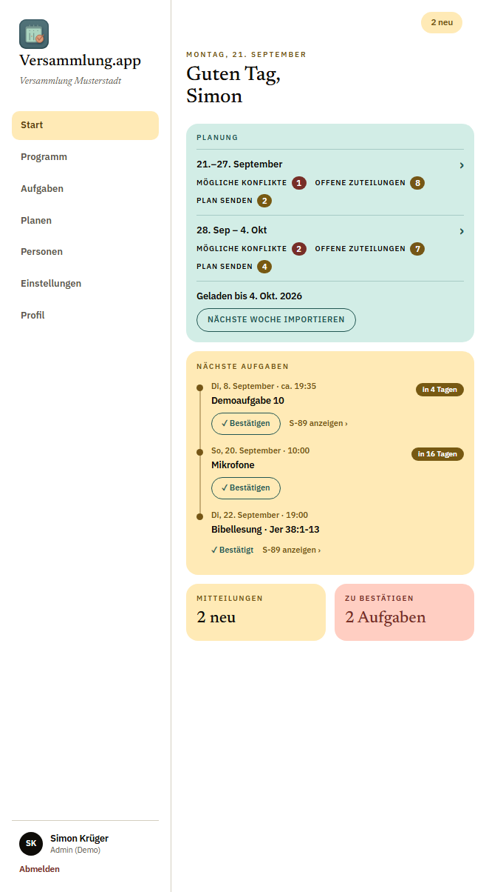
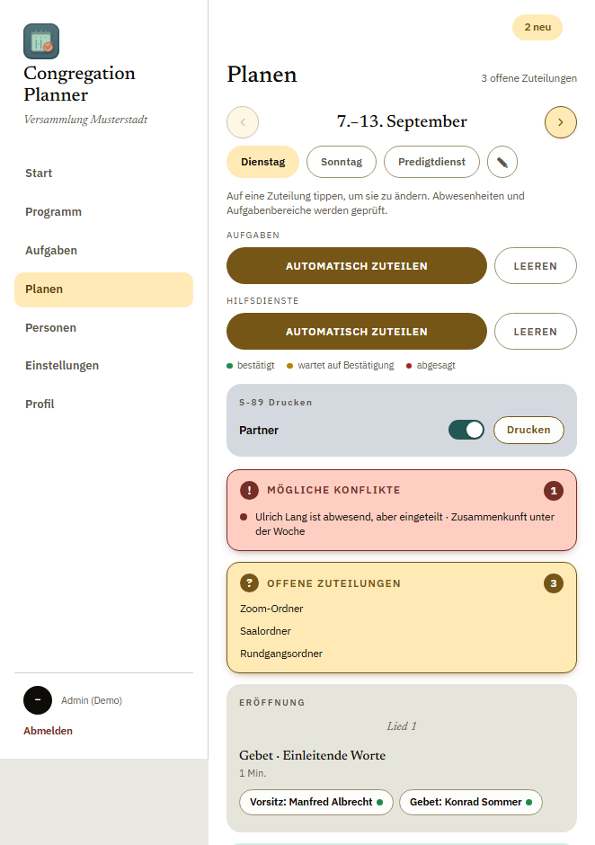
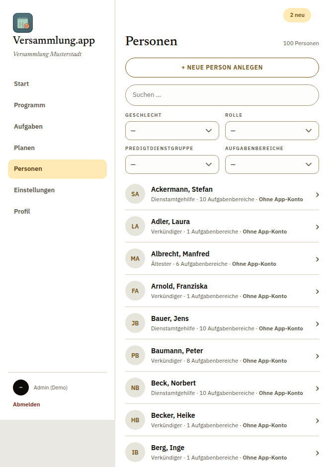
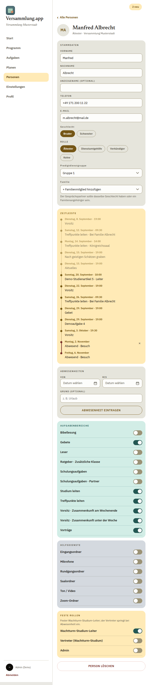
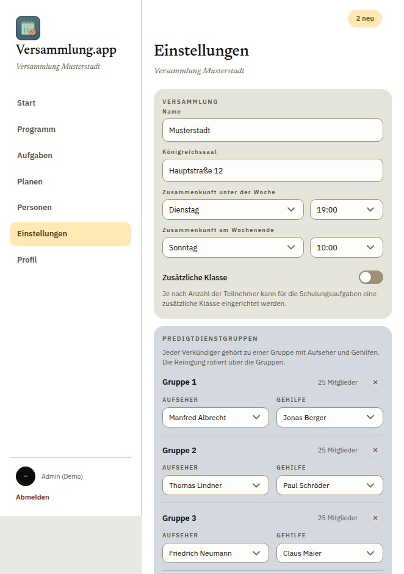

# Benutzerhandbuch für Planer

Dieses Handbuch richtet sich an Koordinatoren und Planer der Versammlung – also an
alle, die Zuteilungen vornehmen, Personen und Gruppen verwalten oder die
Versammlungseinstellungen pflegen.

> Die Grundfunktionen (Anmelden, Programm ansehen, eigene Aufgaben bestätigen,
> Abwesenheiten, Profil) sind im [**Handbuch für Verkündiger**](verkuendiger.md)
> beschrieben und gelten für dich genauso. Dieses Handbuch ergänzt die
> **Planer‑Funktionen**.

---

## Inhalt

1. [Dashboard für Planer](#1-dashboard-für-planer)
2. [Planen: Zuteilungen vornehmen](#2-planen-zuteilungen-vornehmen)
3. [Automatisch zuteilen & leeren](#3-automatisch-zuteilen--leeren)
4. [Konflikte und offene Zuteilungen](#4-konflikte-und-offene-zuteilungen)
5. [Treffpunkte planen](#5-treffpunkte-planen)
6. [Personen verwalten](#6-personen-verwalten)
7. [Einstellungen](#7-einstellungen)
   – [Zusätzliche Klasse](#7a-zusätzliche-klasse)
8. [Programm importieren](#8-programm-importieren)
9. [Programm drucken](#9-programm-drucken)
10. [Ohne Internet (offline)](#10-ohne-internet-offline)

---

## 1. Dashboard für Planer

Als Planer siehst du zusätzlich zur persönlichen Übersicht eine **Planungs‑Karte**
für die aktuelle Woche.

- **Planung · Aktuelle Woche** („6 offene Zuteilungen · 1 Konflikte") führt dich
  mit einem Tippen direkt in die Planung.
- Die Navigation links enthält zusätzlich **Planen**, **Personen** und
  **Einstellungen** – diese Bereiche sehen nur Planer (und Gruppenaufseher einen
  Teil davon).

---

## 2. Planen: Zuteilungen vornehmen

Unter **Planen** teilst du die Aufgaben und Hilfsdienste einer Woche zu. Oben
wechselst du zwischen **Zusammenkunft unter der Woche**, **am Wochenende** und den
**Zusammenkünften für den Predigtdienst**; mit ‹ › wählst du die Woche – auf
Handy und Tablet geht auch seitwärts wischen.

- **Auf eine Zuteilung tippen**, um sie zu ändern. Es öffnet sich eine Liste
  passender Personen. Dabei werden **Abwesenheiten** und **Aufgabenbereiche**
  (Qualifikationen) berücksichtigt, und Doppelbelegungen am selben Tag werden
  angezeigt.
- Programmpunkte (Vorsitz, Gebet, Bibellesung, Schulungsaufgaben …) und
  **Hilfsdienste** (Mikrofone, Ton, Ordner, Reinigung …) werden getrennt geführt.
- Die Legende „✓ bestätigt · … wartet auf Bestätigung" zeigt dir den
  Bestätigungsstatus jeder Person direkt an der Zuteilung.

**Schülerteile im Abschnitt „Uns im Dienst verbessern"** brauchen je nach Art
ein oder zwei Personen. Gesprächsteile (Gespräche beginnen, Interesse fördern,
Menschen zu Jüngern machen) haben einen **Hauptteilnehmer** und einen
**Gesprächspartner** – beide werden getrennt zugeteilt. Vorträge/Ansprachen
haben nur einen (männlichen) Teilnehmer. Die App legt die passende Zahl beim
Import automatisch an; mit **„+ / – Gesprächspartner"** unter dem Teil kannst du
den Partner bei Bedarf hinzufügen oder entfernen. Für den Gesprächspartner
werden nur Personen mit demselben Geschlecht vorgeschlagen – **oder
Familienangehörige** (siehe „Familie" im Personen‑Detail), die auch
geschlechtsübergreifend zusammen eingeteilt werden dürfen. Wer nur als Partner
(nicht als Gesprächsführer) eingeteilt werden soll, bekommt in den Personendaten
den Bereich **„Schulungsaufgaben Partner"**. Die automatische Zuteilung setzt
Gesprächsteile bevorzugt mit Verkündigern und Schwestern (nicht mit Ältesten/
Dienstamtgehilfen) und achtet auf gleiches Geschlecht der beiden Partner.

Das Programm selbst lässt sich hier ebenfalls anpassen: Im Abschnitt **Unser Leben
als Christ** kannst du Punkte hinzufügen, in der Länge (Minuten) anpassen,
verschieben oder entfernen; beim Wochenende trägst du das **Vortragsthema** und
die **Anfangslied‑Nummer** ein.

---

## 3. Automatisch zuteilen & leeren

Oben auf der Planen‑Seite findest du je Bereich zwei Schaltflächen:

| Bereich | Aktion |
| --- | --- |
| **Aufgaben** | **Automatisch zuteilen** besetzt offene Programmpunkte anhand von Qualifikation, Auslastung und Abwesenheiten. **Leeren** entfernt die Zuteilungen des Bereichs. |
| **Hilfsdienste** | Dasselbe für die Hilfsdienste (die Reinigung rotiert dabei über die Predigtdienstgruppen). |

Die Automatik wählt bevorzugt Personen mit der **geringsten Auslastung**, lässt
Abwesende aus und vergibt niemanden doppelt am selben Tag. Externe Redner
(Gastredner, Kreisaufseher) bleiben offen und werden manuell eingetragen. Nach dem
Zuteilen kannst du einzelne Slots wie gewohnt noch von Hand anpassen.

---

## 4. Konflikte und offene Zuteilungen

Die Planen‑Seite weist dich aktiv auf Handlungsbedarf hin:

- **Mögliche Konflikte** – z. B. „Person ist abwesend, aber eingeteilt",
  Doppelbelegungen oder Personen, die drei Wochen in Folge eingeteilt sind.
- **Offene Zuteilungen** – noch unbesetzte Programmpunkte und Hilfsdienste,
  gebündelt aufgelistet.

So siehst du auf einen Blick, was vor der Zusammenkunft noch zu erledigen ist.

---

## 5. Treffpunkte planen

Die **Zusammenkünfte für den Predigtdienst** („Treffpunkte") haben einen eigenen
Reiter unter **Planen**.

Es gibt zwei Arten:

- **Versammlungstreffpunkte** – gelten für die ganze Versammlung.
- **Gruppentreffpunkte** – je Predigtdienstgruppe, mit eigenem Ort und Leiter.

Der regelmäßige Rhythmus kommt aus dem **Grundplan** (siehe
[Einstellungen](#7-einstellungen)); pro Woche kannst du Uhrzeit, Ort und **Leiter**
anpassen oder einen einmaligen Treffpunkt ergänzen. **Gruppenaufseher** können die
Treffpunkte **ihrer** Gruppe selbst planen, ohne vollen Planer‑Zugang.

---

## 6. Personen verwalten

Unter **Personen** pflegst du alle Mitglieder der Versammlung.

- **+ Neue Person anlegen** erstellt einen neuen Eintrag; **+ Alle ohne Konto
  einladen** verschickt Einladungscodes an alle, die noch kein Konto haben.
- Über **Suchen** findest du schnell eine Person – gesucht wird in **Name,
  Telefonnummer und E‑Mail‑Adresse**. Bei Telefonnummern ist die Schreibweise
  egal: „01701234567" findet auch „0170 123 4567".
- Darunter kannst du die Liste nach **Geschlecht**, **Rolle**,
  **Predigtdienstgruppe** und **Aufgabenbereich** einschränken (jeweils
  alphabetisch sortiert). Die Felder wirken zusammen (z. B. alle Brüder aus
  Gruppe 2 mit dem Bereich Mikrofone); „—" bedeutet „nicht eingeschränkt". Die
  Zahl neben der Überschrift zeigt, wie viele Personen gerade übrig bleiben.
- Ein Tippen auf eine Person öffnet ihr Detail:

Unter den Stammdaten steht die **Zeitleiste der Zuteilungen**: alle Aufgaben
dieser Person aus den geladenen Wochen, chronologisch, mit Datum und Art der
Aufgabe – Programmpunkte, Hilfsdienste und geleitete Treffpunkte. Vergangenes
wird blasser dargestellt. Hat jemand keine Zuteilung, entfällt der Abschnitt.

Im Detail legst du fest:

- **Stammdaten** – Name, Anzeigename, Telefon, E‑Mail, Geschlecht.
- **Rolle** – Ältester, Dienstamtgehilfe oder Verkündiger.
- **Predigtdienstgruppe** – Zuordnung zur Gruppe.
- **Familie** – wer zur selben Familie gehört. Familienangehörige dürfen bei
  Schülerteilen auch geschlechtsübergreifend Gesprächspartner sein (z. B.
  Ehepaar, Vater/Tochter).
- **Aufgabenbereiche** – welche Aufgaben die Person übernehmen darf (Vorsitz,
  Vorträge, Gebet, Bibellesung, Schulung, Hilfsdienste …). Diese Bereiche steuern,
  wen die Automatik und die Kandidatenlisten vorschlagen.
- **Konto & Einladung** – hier lädst du eine Person zur App‑Nutzung ein (Code bzw.
  Einladungs‑E‑Mail) und vergibst bei Bedarf **Planer‑Rechte**.

Wird eine Person umbenannt, zieht die App den neuen Namen automatisch durch alle
bereits geplanten Wochen.

---

## 7. Einstellungen

Unter **Einstellungen** verwaltest du die versammlungsweiten Grunddaten.

Die Seite enthält mehrere Abschnitte (nach unten scrollen):

- **Versammlung** – Name, Königreichssaal, Wochentage und Uhrzeiten der beiden
  Zusammenkünfte.
- **Predigtdienstgruppen** – Gruppen mit **Aufseher** und **Gehilfe**. Die
  Reinigung rotiert automatisch über die Gruppen.
- **Hilfsdienste** – welche Dienste es gibt und mit wie vielen Plätzen.
- **Erinnerungen** – wie viele Tage vorher und wie oft an offene Aufgaben erinnert
  wird (per Push, nie per E‑Mail).
- **Sprachen** – Versammlungssprache und weitere Programmsprachen. Zusätzliche
  Sprachen werden beim Import als Varianten mitgeholt.
- **Programm‑Import** – neue Wochen von jw.org laden (siehe unten).
- **Treffpunkte‑Grundplan** – die regelmäßigen Versammlungs‑ und
  Gruppentreffpunkte (Wochentag, Uhrzeit, Ort, „N‑ter im Monat").

---

## 7a. Zusätzliche Klasse

Hat eure Versammlung viele Verkündiger, könnt ihr die **Schulungsaufgaben
parallel in einem zweiten Raum** durchführen – so kommt jeder öfter dran. Den
Schalter dafür findest du in den Einstellungen unter **Versammlung**.

Ist er eingeschaltet, ändert sich Folgendes:

- Beim **Planen** haben die Schülerteile zwei Reihen: **Hauptsaal** und
  **Zusätzliche Klasse**. Betroffen sind die **Bibellesung** und alles unter
  **Uns im Dienst verbessern** – genau die Teile, die nach dem Programmpunkt
  „Nach geistigen Schätzen graben" im zweiten Raum stattfinden.
- Es kommt eine Karte für den **Ratgeber** dazu. Für jede zusätzliche Klasse
  muss ein befähigter Ratgeber da sein, vorzugsweise ein Ältester. Damit du
  jemanden auswählen kannst, setze bei der Person unter **Aufgabenbereiche**
  den Schalter **Ratgeber**.
- **Automatisch zuteilen** besetzt beide Räume und achtet darauf, dass niemand
  gleichzeitig im Hauptsaal und in der Klasse eingeteilt ist.
- Im **Programm** und im **Ausdruck** stehen beide Räume untereinander, jeder
  mit seiner Überschrift.
- Auf dem **S‑89‑Formular** steht jetzt der richtige Raum. Vorher stand dort
  immer „Hauptsaal".

**Ausschalten behält deine Planung.** Die Zuteilungen der Klasse bleiben
gespeichert und sind wieder da, sobald du den Schalter erneut einschaltest.
Solange er aus ist, gibt es die Klasse aber wirklich nicht: Sie steht weder im
Programm noch im Ausdruck, zählt nicht zu den offenen Zuteilungen und es geht
keine Erinnerung dafür hinaus. Neu einzuteilen ist nach dem Wiedereinschalten
nur der **Ratgeber**.

---

## 8. Programm importieren

Über den **Import** in den Einstellungen holt die App das Arbeitsheft‑Programm der
kommenden Woche direkt von jw.org – inklusive Liedern, Bibelbuch,
Schulungspunkten und der Struktur der Zusammenkünfte. Sind weitere Programmsprachen
konfiguriert, werden deren Varianten gleich mitgeladen. Zuteilungen bleiben dabei
leer und werden anschließend unter **Planen** vergeben.

Über dem Knopf steht, wie weit du schon bist: **„Geladen bis …"** nennt den
letzten Tag, für den ein Programm vorliegt, daneben die Anzahl der geladenen
Wochen. Jeder Druck auf den Knopf holt genau eine weitere Woche.

---

## 9. Programm drucken

Auf der **Programm**‑Seite gibt es eine **Drucken**‑Funktion. Sie druckt die
aktuell gewählte Woche und Zusammenkunft sauber auf eine Seite – **ohne die
Hilfsdienste** und ohne die Bedienelemente der App. Der Ausdruck füllt die Seite
in der Breite und passt sich dem im Druckdialog eingestellten Papierformat an
(z. B. A4).

---

## 10. Ohne Internet (offline)

Die App startet auch ohne Internet und zeigt den **letzten geladenen Stand**.
Ein Hinweisstreifen nennt den Zeitpunkt der Aufnahme:

**Planen ist offline gesperrt.** Zuteilen, automatisch zuteilen, Personen
bearbeiten, Einstellungen ändern und Importieren funktionieren nur online. Beim
Versuch erscheint ein kurzer Hinweis; die Schaltflächen bleiben sichtbar, damit
du siehst, was verfügbar wäre.

Das ist Absicht: Zwei Planer, die offline unabhängig voneinander planen, würden
sich beim nächsten Verbinden gegenseitig überschreiben. Deshalb gibt es
**keine** Offline-Änderungen mit späterem Abgleich.

Wichtig zu wissen:

- Der Stand kann **veraltet** sein – vor dem Planen im Saal also erst
  **„Neu laden"** drücken, sobald Netz da ist.
- Zum Nachschauen im Saal ist der Offline-Stand gedacht; zum Planen brauchst du
  eine Verbindung.
- Nach längerer Zeit ohne Verbindung kann eine erneute Anmeldung nötig werden
  (das Anmelden selbst braucht Internet).

---

*Dieses Handbuch beschreibt die aktuelle Funktionsvielfalt. Bei neuen oder
geänderten Funktionen wird es zusammen mit den Screenshots aktualisiert
(siehe [README](README.md)).*
