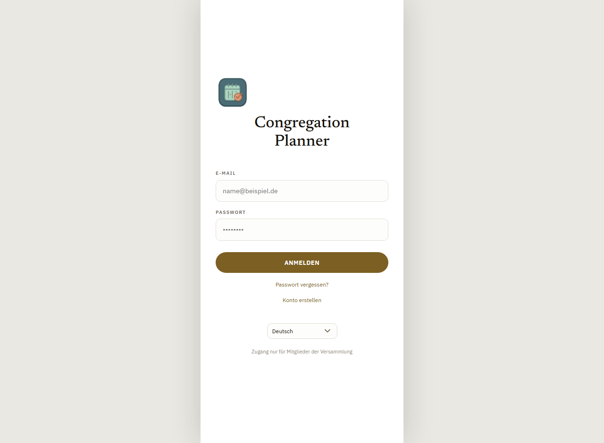
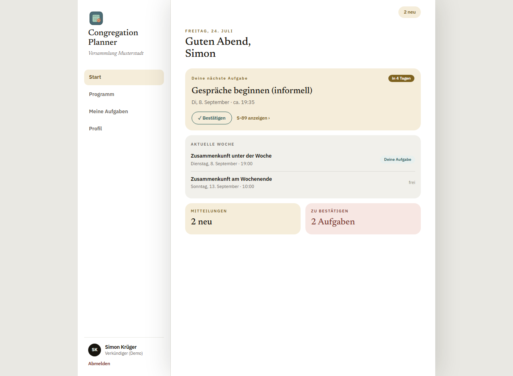
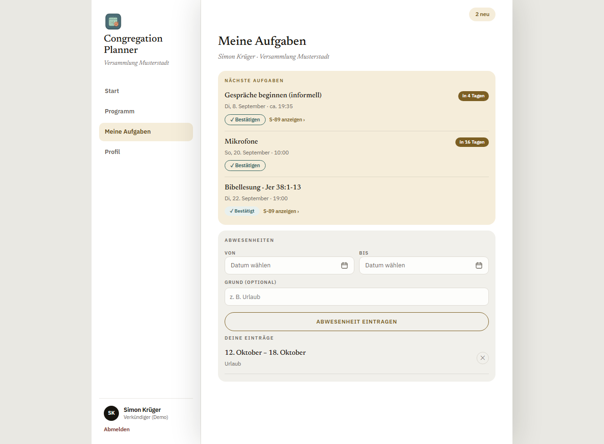
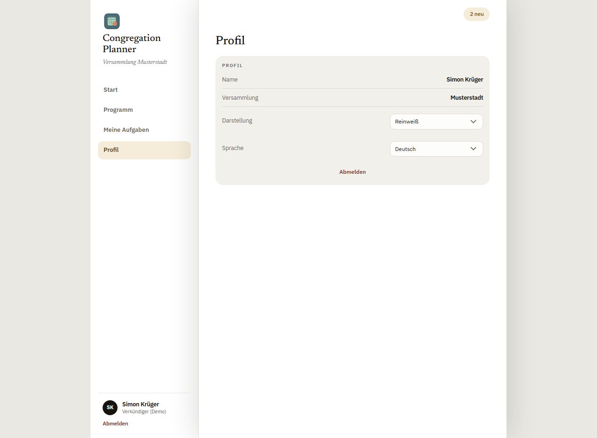

# Benutzerhandbuch für Verkündiger

Dieses Handbuch richtet sich an alle Verkündiger der Versammlung. Es zeigt, wie du
das Programm einsiehst, deine Aufgaben bestätigst, Abwesenheiten einträgst und
die App auf deinem Gerät einrichtest.

> Für Koordinatoren/Planer gibt es ein eigenes Handbuch:
> [**Handbuch für Planer**](planer.md).

---

## Inhalt

1. [Anmelden](#1-anmelden)
2. [Startseite (Dashboard)](#2-startseite-dashboard)
3. [Das Programm ansehen](#3-das-programm-ansehen)
4. [Meine Aufgaben](#4-meine-aufgaben)
5. [Abwesenheiten eintragen](#5-abwesenheiten-eintragen)
6. [Profil: Darstellung & Sprache](#6-profil-darstellung--sprache)
7. [App installieren & Erinnerungen](#7-app-installieren--erinnerungen)

---

## 1. Anmelden

Du meldest dich mit der E‑Mail‑Adresse an, für die du eine Einladung von deinem
Koordinator erhalten hast, und dem selbst gewählten Passwort.

- **Passwort vergessen?** öffnet die Zurücksetzen‑Funktion – du bekommst eine
  E‑Mail mit einem Link, um ein neues Passwort zu setzen.
- **Konto erstellen** brauchst du nur beim ersten Mal, wenn dein Koordinator dir
  einen Einladungscode gegeben hat.
- Unten kannst du die **Sprache der App** wählen.

---

## 2. Startseite (Dashboard)

Nach der Anmeldung landest du auf deiner persönlichen Startseite. Sie fasst das
Wichtigste zusammen.

- **Deine nächste Aufgabe** – die anstehende Zuteilung mit Datum und einem
  Countdown‑Chip („in 4 Tagen"). Direkt hier kannst du **Bestätigen** oder das
  **S‑89**‑Formular ansehen.
- **Aktuelle Woche** – die beiden Zusammenkünfte mit Datum und Uhrzeit; „Deine
  Aufgabe" markiert eine Woche, in der du eingeteilt bist.
- **Mitteilungen** und **Zu bestätigen** zeigen dir auf einen Blick, ob etwas
  Neues für dich da ist.

Über die Navigation links (bzw. das Menü auf dem Handy) erreichst du **Start**,
**Programm**, **Meine Aufgaben** und **Profil**.

---

## 3. Das Programm ansehen

Unter **Programm** siehst du das vollständige Zusammenkunfts‑Programm der Woche.
Mit den Pfeilen ‹ › blätterst du zwischen den Wochen; die aktuelle Woche ist mit
einem Chip markiert.

Oben wählst du zwischen drei Ansichten:

| Reiter | Inhalt |
| --- | --- |
| **Zusammenkunft unter der Woche** | Das Programm der Wochenmitte (Schätze aus Gottes Wort, Dienst, Unser Leben als Christ) mit allen Zuteilungen. |
| **Zusammenkunft am Wochenende** | Öffentlicher Vortrag und Wachtturm‑Studium. |
| **Zusammenkünfte für den Predigtdienst** | Die „Treffpunkte" – wann und wo sich die Versammlung bzw. deine Gruppe zum Predigtdienst trifft, mit dem jeweiligen Leiter. |

Bei den Treffpunkten siehst du **Versammlungstreffpunkte** (für alle) und die
**Gruppentreffpunkte** deiner Predigtdienstgruppe – jeweils mit Uhrzeit, Ort und
Leiter.

---

## 4. Meine Aufgaben

Unter **Meine Aufgaben** siehst du alle Zuteilungen, die dich betreffen, in
zeitlicher Reihenfolge.

Für jede Aufgabe gilt:

- **✓ Bestätigen** – teile deinem Koordinator mit, dass du die Aufgabe
  übernimmst. Danach steht bei der Aufgabe „Bestätigt".
- **S‑89 anzeigen** – bei Schulungsaufgaben öffnet sich die
  Aufgabenzuteilung (Rahmen, Gesprächspartner, Schulungspunkt), die du dem
  Gehilfen zeigen kannst.
- Kannst du **nicht**, melde das bitte deinem Koordinator – so kann er rechtzeitig
  neu einteilen.

> **Tipp:** Bestätige zeitnah. Dein Koordinator sieht offene Bestätigungen und
> weiß dann, dass alles steht.

---

## 5. Abwesenheiten eintragen

Direkt unter deinen Aufgaben findest du den Bereich **Abwesenheiten**. Trage hier
ein, wann du z. B. im Urlaub oder verhindert bist – dann wirst du in dieser Zeit
nicht eingeteilt.

1. **Von** und **Bis** wählen (Datumsauswahl).
2. Optional einen **Grund** angeben (z. B. „Urlaub").
3. Auf **Abwesenheit eintragen** tippen.

Deine eingetragenen Zeiträume erscheinen darunter unter „Deine Einträge" und
lassen sich mit dem ✕ wieder entfernen.

---

## 6. Profil: Darstellung & Sprache

Unter **Profil** stellst du persönliche Vorlieben ein.

- **Darstellung** – das Farbschema der App (z. B. Reinweiß oder ein dunkles
  Design). Die Einstellung gilt nur für dein Gerät.
- **Sprache** – die Anzeigesprache der App. Ist das Programm in einer weiteren
  Sprache verfügbar, werden Programmpunkte automatisch mit übersetzt.
- **Abmelden** – meldet dich auf diesem Gerät ab.

---

## 7. App installieren & Erinnerungen

Der Congregation Planner ist eine **Web‑App (PWA)** – du brauchst nichts aus einem
Store zu laden.

- **Auf dem Handy installieren:** Öffne die App im Browser und wähle im Menü
  „Zum Startbildschirm hinzufügen" (Android) bzw. das Teilen‑Symbol →
  „Zum Home‑Bildschirm" (iPhone). Danach startet sie wie eine normale App.
- **Erinnerungen (Push‑Benachrichtigungen):** Wo dein Gerät es unterstützt,
  kannst du Erinnerungen an anstehende Aufgaben als Push‑Nachricht erhalten. Auf
  dem iPhone funktioniert das nur, wenn die App zuvor zum Home‑Bildschirm
  hinzugefügt wurde. **Erinnerungen kommen ausschließlich als Push‑Nachricht –
  nie per E‑Mail.**

---

*Fragen zur Bedienung beantwortet dein Versammlungskoordinator.*
