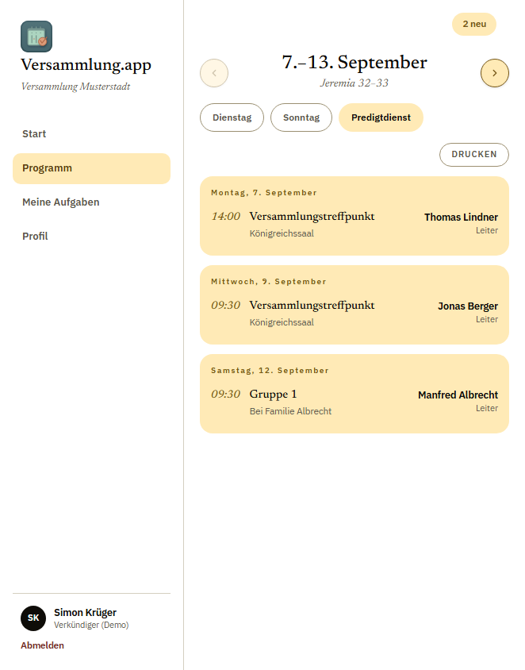

# Benutzerhandbuch für Verkündiger

Dieses Handbuch richtet sich an alle Verkündiger der Versammlung. Es zeigt, wie du
das Programm einsiehst, deine Aufgaben bestätigst, Abwesenheiten einträgst und
die App auf deinem Gerät einrichtest.

> Für Koordinatoren/Planer gibt es ein eigenes Handbuch:
> [**Handbuch für Planer**](planer.md).

---

## Inhalt

1. [Anmelden](#1-anmelden)
2. [Startseite (Dashboard)](#2-startseite-dashboard)
3. [Das Programm ansehen](#3-das-programm-ansehen)
4. [Meine Aufgaben](#4-meine-aufgaben)
5. [Abwesenheiten eintragen](#5-abwesenheiten-eintragen)
6. [Bedienung auf Handy und Tablet](#6-bedienung-auf-handy-und-tablet)
7. [Profil: Darstellung, Schriftgröße & Sprache](#7-profil-darstellung-schriftgröße--sprache)
8. [App installieren & Erinnerungen](#8-app-installieren--erinnerungen)
9. [Ohne Internet (offline)](#9-ohne-internet-offline)

---

## 1. Anmelden

Du meldest dich mit der E‑Mail‑Adresse an, für die du eine Einladung von deinem
Koordinator erhalten hast, und dem selbst gewählten Passwort.

- **Passwort vergessen?** öffnet die Zurücksetzen‑Funktion – du bekommst eine
  E‑Mail mit einem Link, um ein neues Passwort zu setzen.
- **Konto erstellen** brauchst du nur beim ersten Mal, wenn dein Koordinator dir
  einen Einladungscode gegeben hat.
- Unten kannst du die **Sprache der App** wählen.

---

## 2. Startseite (Dashboard)

Nach der Anmeldung landest du auf deiner persönlichen Startseite. Sie fasst das
Wichtigste zusammen.

- **Deine nächste Aufgabe** – die anstehende Zuteilung mit Datum und einem
  Countdown‑Chip („in 4 Tagen"). Direkt hier kannst du **Bestätigen** oder das
  **S‑89**‑Formular ansehen.
- **Aktuelle Woche** – die beiden Zusammenkünfte mit Datum und Uhrzeit; „Deine
  Aufgabe" markiert eine Woche, in der du eingeteilt bist.
- **Mitteilungen** und **Zu bestätigen** zeigen dir auf einen Blick, ob etwas
  Neues für dich da ist.

Über die Navigation links (bzw. das Menü auf dem Handy) erreichst du **Start**,
**Programm**, **Meine Aufgaben** und **Profil**.

---

## 3. Das Programm ansehen

Unter **Programm** siehst du das vollständige Zusammenkunfts‑Programm der Woche.
Mit den Pfeilen ‹ › blätterst du zwischen den Wochen; die aktuelle Woche ist mit
einem Chip markiert. Auf dem Handy oder Tablet kannst du stattdessen auch
**seitwärts wischen** – nach links zur nächsten, nach rechts zur vorigen Woche.
Federt die Ansicht zurück, gibt es in der Richtung keine Woche mehr.

Oben wählst du zwischen drei Ansichten:

| Reiter | Inhalt |
| --- | --- |
| **Zusammenkunft unter der Woche** | Das Programm der Wochenmitte (Schätze aus Gottes Wort, Dienst, Unser Leben als Christ) mit allen Zuteilungen. |
| **Zusammenkunft am Wochenende** | Öffentlicher Vortrag und Wachtturm‑Studium. |
| **Zusammenkünfte für den Predigtdienst** | Die „Treffpunkte" – wann und wo sich die Versammlung bzw. deine Gruppe zum Predigtdienst trifft, mit dem jeweiligen Leiter. |

Bei den Treffpunkten siehst du **Versammlungstreffpunkte** (für alle) und die
**Gruppentreffpunkte** deiner Predigtdienstgruppe – jeweils mit Uhrzeit, Ort und
Leiter. Die Treffpunkte **anderer** Gruppen stehen nicht dabei; sie gehen dich
nicht an, und die Liste bliebe sonst voller Termine, zu denen niemand geht.
Bist du keiner Gruppe zugeordnet, siehst du die Versammlungstreffpunkte.

### Zusätzliche Klasse

Führt eure Versammlung eine **zusätzliche Klasse** durch, stehen bei den
Schülerteilen zwei Blöcke untereinander: **Hauptsaal** und **Zusätzliche
Klasse**. Betroffen sind die Bibellesung und die Teile unter „Uns im Dienst
verbessern"; die Teilnehmer gehen dafür nach dem Programmpunkt „Nach geistigen
Schätzen graben" in den zweiten Raum und kommen nach der letzten
Schulungsaufgabe zurück.

Bist **du** eingeteilt, siehst du am Block, in welchem Raum – und auf deinem
**S‑89‑Zettel** steht es ebenfalls.

---

## 4. Meine Aufgaben

Unter **Meine Aufgaben** siehst du alle Zuteilungen, die dich betreffen, in
zeitlicher Reihenfolge. **Vergangenes fällt heraus** – ab dem Tag nach der
Zusammenkunft. Es wird dir also nicht mehr zum Bestätigen vorgelegt und zählt
auf der Startseite nicht mehr mit.

Für jede Aufgabe gilt:

- **✓ Bestätigen** – teile deinem Koordinator mit, dass du die Aufgabe
  übernimmst. Danach steht bei der Aufgabe „Bestätigt".
- **S‑89 anzeigen** – siehe unten.
- **Antippen** öffnet die Aufgabe. Dort kannst du sie auch **absagen** – und
  eine Absage später wieder zurücknehmen.

> **Tipp:** Bestätige zeitnah. Dein Koordinator sieht offene Bestätigungen und
> weiß dann, dass alles steht.

### Wenn du nicht kannst

Tippe die Aufgabe an und wähle **„Ich kann nicht"**. Dein Koordinator bekommt
eine Mitteilung und kann rechtzeitig neu einteilen. Hast du dich vertan, öffne
die Aufgabe erneut und wähle **„Doch bestätigen"**.

Bei einem **Hilfsdienst** (Mikrofone, Ton, Ordner …) passiert zusätzlich etwas:
Die App sucht sofort selbst einen Ersatz und benachrichtigt alle, die für
diesen Dienst eingetragen und an dem Tag nicht abwesend sind. Du musst also
niemanden persönlich anrufen.

Bei **Programmpunkten** gibt es keine automatische Suche – dort teilt der
Koordinator neu zu.

### Einspringen für jemand anderen

Sagt jemand einen Hilfsdienst ab, für den **du** eingetragen bist, bekommst du
eine Mitteilung („Ersatz gesucht") und – falls aktiviert – eine Push-Nachricht.
Die Anfrage geht **nur an die, die für diesen Dienst freigegeben und an dem Tag
nicht abwesend sind** – du bekommst also nichts angeboten, was nicht zu dir
passt.

Du bekommst es auf zwei Wegen zu sehen, und dafür musst du nichts suchen:

- **Beim Öffnen der App** – dasselbe Blatt, das dich an unbestätigte
  Zuteilungen erinnert, zeigt darunter den Bereich **EINSPRINGEN**. Hast du
  nichts zu bestätigen, steht dort nur die Anfrage, und du kannst das Blatt mit
  **✕** weglegen: Einspringen kannst du, müssen tust du es nicht.
- Unter **Meine Aufgaben** – dort steht der Bereich **EINSPRINGEN** dauerhaft,
  solange die Anfrage offen ist.

Beide zeigen dasselbe: den gesuchten Dienst, den Termin und den Namen dessen,
der abgesagt hat. Hast du an dem Tag **schon etwas anderes**, steht es rot
darunter („An diesem Tag schon: …") – du siehst es also, bevor du zusagst. Ein
Tipp auf **Übernehmen** trägt dich ein und bestätigt die Aufgabe gleich mit.

Es gilt: **wer zuerst tippt.** War jemand schneller, verschwindet der Eintrag –
dann ist der Dienst schon besetzt.

### Das S‑89-Formular

Bei Schulungsaufgaben (Bibellesung, Gespräche beginnen, Interesse fördern …)
steht bei der Aufgabe **S‑89 anzeigen**. Das öffnet die Aufgabenzuteilung, wie
sie sonst auf Papier ausgeteilt wird:

- **Name** und ggf. **Gesprächspartner/in**
- **Datum** der Zusammenkunft
- **Aufgabe** und **Schulungspunkt**
- **Durchzuführen im** – Hauptsaal oder Zusätzliche Klasse

Quelle und Schulungspunkt stehen im Arbeitsheft; das Formular nennt sie, soweit
sie beim Import mitgekommen sind. Du kannst es ansehen und deinem Gehilfen
zeigen – ausdrucken musst du es nicht.

---

## 5. Abwesenheiten eintragen

Direkt unter deinen Aufgaben findest du den Bereich **Abwesenheiten**. Trage hier
ein, wann du z. B. im Urlaub oder verhindert bist – dann wirst du in dieser Zeit
nicht eingeteilt.

1. **Von** und **Bis** wählen (Datumsauswahl).
2. Optional einen **Grund** angeben (z. B. „Urlaub").
3. Auf **Abwesenheit eintragen** tippen.

Deine eingetragenen Zeiträume erscheinen darunter unter „Deine Einträge" und
lassen sich mit dem ✕ wieder entfernen.

Dort stehen auch Zeiträume, die **nicht du** eingetragen hast: Der Planer kann
sie für dich erfassen (etwa wenn du angerufen hast), und beim Umstieg von einem
anderen Programm sind sie mit übernommen worden. Es ist dieselbe Liste – du
kannst sie genauso ändern oder entfernen. Umgekehrt siehst du hier **nur deine
eigenen**; die Abwesenheiten anderer gehen dich nichts an.

**Es zählt der Tag, nicht die Woche.** Bist du nur übers Wochenende weg, bleibst
du für die Zusammenkunft unter der Woche eingeplant – und umgekehrt. Auch bei den
Treffpunkten wird der jeweilige Wochentag geprüft. Der Planer sieht deinen
Eintrag beim Zuteilen als Hinweis „abwesend", und die automatische Zuteilung
übergeht dich in diesem Zeitraum.

---

## 6. Bedienung auf Handy und Tablet

Neben dem Antippen gibt es ein paar Gesten. Sie sind immer nur eine Abkürzung –
alles geht auch weiterhin über Knöpfe und Pfeile.

- **Seitwärts wischen** – blättert im **Programm** und beim **Planen** eine
  Woche vor oder zurück.
- **Zurück** (Zurück‑Taste oder Zurück‑Geste) – schließt ein geöffnetes Fenster,
  das Menü oder die Mitteilungen, statt die App zu verlassen. Ist nichts
  geöffnet, verlässt Zurück die App wie gewohnt.
- **Nach unten wischen** – schließt ein von unten eingeblendetes Fenster. Der
  kurze Strich am oberen Rand zeigt, dass es sich ziehen lässt.

Auf einem Tablet im Querformat – und auf allen Bildschirmen ab etwa Tablet‑Breite –
steht das Menü dauerhaft links, statt sich hinter dem Menüknopf zu verbergen.

## 7. Profil: Darstellung, Schriftgröße & Sprache

Unter **Profil** stellst du persönliche Vorlieben ein.

- **Darstellung** – das Farbschema der App (z. B. **Jasmin** oder ein dunkles
  Design). Die Einstellung gilt nur für dein Gerät. Die Namen sind
  Eigennamen aus Pflanzen und Gewürzen und stehen in jeder Sprache gleich da:
  hell **Jasmin**, **Indigo**, **Olive**, **Papaya**, **Vanille**, **Sesam**;
  dunkel **Matcha**, **Safran**, **Aubergine**, **Mango**.
  - **Hoher Kontrast** – schwarze Schrift auf Weiß, deutlich abgesetzte
    Farbflächen und gut sichtbare Rahmen. Zusammen mit einer größeren
    Schriftgröße ist die App damit auch bei eingeschränktem Sehvermögen gut
    lesbar. Als einziges Schema trägt es einen übersetzten Namen – es
    beschreibt eine Funktion, keine Farbe.
  - **Vanille** – die besonders zurückhaltende Variante mit sehr weichen
    Farben. Die übrigen Schemata sind bewusst etwas kräftiger, damit sich die
    Programmabschnitte klarer voneinander abheben.
  - **Sesam** – ganz ohne Farbe, nur Grautöne. Die Programmabschnitte
    unterscheiden sich hier allein durch ihre Helligkeit: von oben nach unten
    wird jeder Abschnitt eine Stufe dunkler.
- **Schriftgröße** – ein Regler von **Klein** bis **Sehr groß**. Standard ist die
  bisherige Größe; wenn dir der Text zu klein ist, schiebe ihn nach rechts. Die
  Änderung wirkt sofort in der ganzen App und gilt nur für dein Gerät.
- **Sprache** – die Anzeigesprache der App. Ist das Programm in einer weiteren
  Sprache verfügbar, werden Programmpunkte automatisch mit übersetzt.
- **Push‑Mitteilungen** – Erinnerungen an anstehende Aufgaben ein‑ oder
  ausschalten (siehe [Abschnitt 7](#7-app-installieren--erinnerungen)).
- **Abmelden** – meldet dich auf diesem Gerät ab.

---

## 8. App installieren & Erinnerungen

Der Congregation Planner ist eine **Web‑App (PWA)** – du brauchst nichts aus einem
Store zu laden. Du öffnest die Adresse im Browser und legst sie dir als App ab.

### Android (Chrome)

1. Die App‑Adresse in **Chrome** öffnen.
2. Im **⋮**‑Menü **App installieren** antippen. Je nach Chrome‑Version heißt der
   Eintrag *Installieren* oder – weiter unten – *Zum Startbildschirm hinzufügen*.
3. Bestätigen. Die App liegt danach wie jede andere im App‑Menü und startet ohne
   Browserleiste.

> Chrome zeigt **von selbst kein Hinweisbanner** mehr an. Wenn beim Öffnen nichts
> erscheint, ist nichts kaputt – der Eintrag steckt nur im ⋮‑Menü.

### iPhone / iPad (Safari)

1. Die App‑Adresse in **Safari** öffnen. In Chrome auf dem iPhone fehlt der
   nötige Eintrag meist – Safari ist hier der zuverlässige Weg.
2. Das **Teilen**‑Symbol antippen (Quadrat mit Pfeil nach oben) und nach unten
   scrollen.
3. **Zum Home‑Bildschirm** → **Hinzufügen**.

### Wenn kein Installieren angeboten wird

- Hast du den Link **aus WhatsApp, Telegram oder einer E‑Mail** geöffnet? Diese
  Apps zeigen die Seite in einem eingebauten Browser, der nicht installieren kann
  – erkennbar an der fehlenden Adresszeile. Über das Menü der App
  **In Chrome öffnen** bzw. **In Safari öffnen** wählen und es dort erneut
  versuchen.
- Möglicherweise ist die App **schon installiert** – dann verschwindet der
  Eintrag aus dem Menü.

### Danach einmal mit Internet anmelden

Melde dich nach dem Installieren einmal **mit Internetverbindung** an und sieh dir
Programm und Aufgaben an. Erst dadurch legt die App den Stand ab, den sie dir
später [ohne Internet](#8-ohne-internet-offline) zeigen kann. Direkt nach dem
Installieren ist offline noch nichts vorhanden.

### Erinnerungen (Push‑Benachrichtigungen)

Wo dein Gerät es unterstützt, kannst du Erinnerungen an anstehende Aufgaben als
Push‑Nachricht erhalten – über den Schalter **Push‑Mitteilungen** unter
**Profil**. Er erscheint nur, wenn dein Browser Push unterstützt. Auf dem iPhone
funktioniert das
**nur aus der installierten App** – im normalen Safari‑Tab kommen keine
Benachrichtigungen an. **Erinnerungen kommen ausschließlich als Push‑Nachricht –
nie per E‑Mail.**

---

## 9. Ohne Internet (offline)

Im Saal ist der Empfang manchmal schlecht. Die App startet deshalb auch ohne
Internet und zeigt dir den **letzten Stand**, den sie beim letzten Mal geladen
hat. Oben erscheint dann ein Hinweisstreifen mit dem Zeitpunkt:

- **Lesen geht:** Programm, Treffpunkte, deine Aufgaben und Abwesenheiten sind
  wie zuletzt geladen sichtbar.
- **Ändern geht nicht:** Bestätigen, Abwesenheiten eintragen oder Ähnliches ist
  gesperrt – sonst würde deine Eingabe verloren gehen, weil sie niemand
  empfangen kann. Beim Antippen erscheint ein kurzer Hinweis.
- **„Neu laden"** holt den aktuellen Stand, sobald du wieder Netz hast.

Zwei Dinge, die du wissen solltest:

- Der angezeigte Stand kann **veraltet** sein. Steht im Streifen z. B. „Stand von
  gestern", kann sich eine Zuteilung inzwischen geändert haben.
- Warst du **lange** nicht mehr online, kann es passieren, dass die App dich
  wieder nach dem Passwort fragt. Das Anmelden selbst braucht Internet.

---

*Fragen zur Bedienung beantwortet dein Versammlungskoordinator.*
